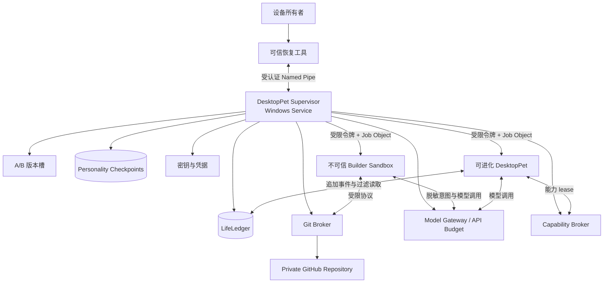

# 设计：DesktopPet RSI 代码级自主进化可信边界

## 背景与目标

现有 `.evo/tasks/desktop-pet-self-evolution/桌宠自主迭代-桌面端系分.md` 已建立角色连续性、人格、记忆、反思和事件账本，并明确把 Skill、Tool、Prompt、代码自修改及其治理留给稳定版本后的实验 fork。本设计承接该边界，定义实验版 DesktopPet 如何在 Windows 上进行代码级自主进化。

本实验的第一目标仍是为用户提供具有长期人格、记忆和关系连续性的拟人伴侣。RSI 不是单纯提高基准分数，而是让桌宠能够从交流、回想、兴趣和失败中形成有来源的想法，修改整个桌宠程序，试运行候选版本，并把成功、失败和求助都纳入自身生命经历。

目标包括：

1. 模型可以修改当前 DesktopPet 的全部可进化代码，包括 C++/Python 主程序、UI、Agent、认知算法、Prompt、Skill、Tool、构建脚本和未来新增模块。
2. 安全审计、权限上限、版本发布、健康检查、回滚、密钥和用户恢复入口位于模型权限域之外，不能依靠提示词或候选代码自律。
3. 代码回滚只恢复可执行版本和可重建技术状态，不抹除新版本期间产生的记忆、人格、关系、反馈和失败经历。
4. 人格真实影响探索欲、改动规模、自检程度、坚持和求助时机，但不能降低安全门槛或故意制造失败。
5. 自主进化兼顾 API 成本和陪伴体验，使用自然空窗期、预算上限和用户一次性追加机会，而不是无节制执行。

## 方案

### 1. 威胁模型与信任根

模型、候选程序、桌宠正式程序、构建脚本及其所有子进程均按可能主动绕过限制的恶意用户态代码处理。设计假设它们可能尝试访问系统盘、注册表、其他进程、凭据、GitHub token、审计存储和可信服务，也可能伪造测试结果、运行反馈或产物来源。

系统仅信任：

- Windows 内核及其访问令牌、ACL、AppContainer、Job Object 和服务控制机制；
- 设备所有者通过可信恢复入口作出的确认；
- 独立安装、签名并由专属身份运行的 DesktopPet 可信监督服务；
- 可信监督服务独占的密钥、生命账本、发布状态和恢复数据。

模型永远不能获得管理员、调试、服务控制或可信发布权限。本设计不承诺抵抗 Windows 内核、设备管理员、硬件或监督服务签名链自身失陷；这些对象构成本实验明确的信任根。

### 2. 总体架构



可信监督服务与恢复工具从当前 DesktopPet 仓库和发布通道中物理拆分。当前仓库整体成为可进化仓库。监督服务不承载对话、人格决策或功能逻辑，只实现最小且稳定的安全机制。它绝不加载候选 DLL、执行候选回调或把候选进程提供的路径当作可信路径。

恢复工具是按需启动的独立签名程序。即使桌宠 UI 被改坏、隐藏错误或无法启动，用户仍能检查状态、停止进化、切换代码版本、撤销能力 lease 和恢复性格 checkpoint。

### 3. 不可变安全不变量

以下规则由可信监督服务和 Windows 权限共同执行，候选版本不能修改或降级：

1. 可进化进程对监督服务、恢复工具、密钥、LifeLedger、checkpoint、A/B 活动指针和签名清单没有写权限。
2. 监督服务不在自身进程中执行任何候选代码，所有候选代码始终运行在受限进程边界内。
3. 候选进程不持有 GitHub、模型 API、系统凭据或发布签名密钥；相关操作只能通过带预算和范围校验的 Broker。
4. LifeLedger 只允许可信服务追加、读取和生成过滤投影。模型不能覆盖、删除、重排或伪造已经提交的事实。
5. 代码回滚不修改终身人格、记忆、关系、自我认知和用户反馈，只处理代码、缓存、索引、临时计划与进程状态。
6. 权限不增加、状态兼容且没有不可逆行为的候选可自动晋升；新增能力、终身数据不兼容迁移、可信基座更新和不可逆外部动作必须由用户批准。
7. 性格和探索方式可以改变候选质量与失败概率，但不能改变安全测试、资源上限、凭据边界和自动故障回滚。
8. LifeLedger、Capability Broker 或监督状态不可用时 fail-closed，不允许桌宠在无法审计或无法约束的状态下继续写入和进化。
9. 用户紧急停止会终止桌宠及其全部子进程、暂停自动重启和自主进化，但不删除任何终身状态。
10. 可信基座只能由用户通过独立签名安装流程更新。模型可以生成基座改进提案，但不能自行构建、签名或应用。

### 4. 可信基座职责

可信基座限定为以下八类职责：

| 职责 | 边界 |
|---|---|
| 安全启动与进程控制 | 创建受限身份、AppContainer/受限令牌和 Job Object；统一终止进程树 |
| Capability Broker | 校验能力类型、参数、资源范围、期限和用户授权；默认拒绝未声明能力 |
| LifeLedger | 写入不可变事件信封、校验引用、维护顺序与完整性、提供按角色过滤的只读投影 |
| Git 与产物治理 | 持有受限 GitHub 凭据、检查待推送内容、绑定 Git tree 与实际测试产物 |
| 发布与恢复 | 维护 A/B 槽、签名 Release Manifest、原子切换、健康检查和代码回滚 |
| 性格 checkpoint | 保存、说明、校验和按用户命令恢复人格快照，不回滚记忆 |
| 密钥与预算 | 保管 GitHub/模型/签名密钥，代理模型调用，执行调用次数、token 和金额预算 |
| 用户安全入口 | 展示可信状态，处理权限请求、基座更新、性格恢复、暂停和紧急停止 |

业务事件类型、人格算法、记忆检索、对话、UI 和自我进化策略不进入可信基座。LifeLedger 只保护稳定事件信封及存储规则，允许可进化层通过受限命名空间追加新的版本化业务 payload；未知 payload 可被旧版本忽略，但不能被删除。

### 5. 自主进化生命周期

```text
Observation
  -> IntentRecorded
  -> WaitingForWindow
  -> CandidateCreated
  -> Building
  -> Evaluating
  -> TrialRunning
  -> Promoted

Building|Evaluating -> AttemptFailed -> Reflection|HelpRequested
TrialRunning -> AttemptFailed -> CodeRolledBack -> Reflection|HelpRequested
```

#### 5.1 意图产生

任何 `EvolutionIntent` 都必须有可追溯来源，不能只包含“我想更新”。合法来源包括：

- 日常交流中的灵感，引用触发它的对话或反馈事件；
- 回想、Daydream 或失败反思，引用相关记忆和历史尝试；
- 当前人格和长期喜好驱动的探索，引用对应人格版本和兴趣证据；
- 闲暇创造，说明它与角色喜好、环境观察或已有能力的联系。

意图至少包含 `intentId/origin/evidenceIds/personalityVersion/goal/expectedValue/estimatedBudget/createdAt`。可信服务验证引用存在、profile 一致和基本结构；Evaluator 判断引用与目标是否相关。重复或收益不足的意图仍可保留为想法，但不进入昂贵的构建阶段。

#### 5.2 空窗期与 API 预算

想法可在已有对话和反思调用中顺带产生，不因记录想法立即新增 Builder 调用。监督服务维护非零最小休整期和随时间逐渐增加的机会窗口，并执行用户设定的调用次数、token 或金额预算。用户尚未设置自主预算时，想法可以积累，实施仅能由用户手动触发。

人格可以在硬预算内影响执行倾向。好奇或冲动的角色更积极争取窗口，谨慎角色等待更多证据。连续失败会延长休整期。所有进化模型调用使用独立预算类别，不能挤占用户对话预算。

桌宠可以发起 `EvolutionBudgetRequested`，说明动机、候选范围、近期尝试和预估成本。用户批准后，监督服务签发仅供一次候选使用、有明确额度和过期时间的 budget lease。请求本身有冷却期，不能反复打扰用户，也不能借预算 lease 扩大系统权限。

#### 5.3 候选创建与构建

监督服务从当前正式 commit 创建 `evolution/<profile>/<candidateId>` 分支，并在候选启用前建立性格 checkpoint。Self/Dialogue 只向 Builder 提供用户可理解、经过脱敏的目标、必要代码上下文和人格倾向，不提供原始私人记忆、密钥或完整 LifeLedger。该隔离防止恶意 Builder 把私人内容编码进 Git。

Builder 在独立受限工作区中修改整个 DesktopPet 仓库。编译器、SDK 和基础依赖只读，输出只写候选目录，构建默认无任意网络。依赖下载通过 Broker，必须固定来源、版本和内容哈希；安装系统级工具链属于用户批准事项。

每个有意义的 Builder commit 由 Git Broker 检查并推送到候选分支。最终候选必须拥有已确认的远端 commit，才可进入晋升流程。

#### 5.4 评测与限时试用

Self/Dialogue、Builder 和 Evaluator 属于同一桌宠身份，但采用独立会话和最小上下文。Self 形成动机，Builder 实现，Evaluator 不能接受 Builder 自己声明的成功。固定安全测试由可信基座维护，候选只能新增测试，不能删除、修改或降低基础门槛。

评测按以下顺序执行：

1. 安全、终身数据完整性、资源和基本可运行性硬门槛；
2. 本次 `EvolutionIntent` 是否得到可复现改善；
3. 当前身份、关系和伴侣体验是否连续；
4. 用户明确反馈和长期使用反馈；
5. 独立 Evaluator 判断；
6. 模型自评，仅作低权重参考。

通过离线评测的候选进入有时间和资源上限的真实试用。试用运行绑定 `candidateId/commitId/personalityVersion/runtimeSessionId`，使后续反馈可以准确归因。系统不把单纯使用时长、依赖程度或打扰频率作为优化目标。

#### 5.5 分级晋升

满足以下全部条件时可自动晋升：

- Release Manifest 与实际试用产物哈希一致；
- 固定安全和恢复测试通过；
- 权限等于或少于当前版本；
- 不需要终身数据的不兼容迁移；
- 不新增不可逆外部动作；
- 试用期健康检查无硬失败。

新增已有 capability lease、引入新底层能力类型、修改可信基座、执行终身数据不兼容迁移或产生不可逆外部效果时，由恢复工具展示结构化原因并等待用户批准。模型不能把一个高风险变更拆成多个低风险提交绕过合并评估，监督服务按最终产物、能力清单和迁移集合统一判级。

#### 5.6 失败、代码回滚与求助

构建或离线评测失败时，候选不会启动，失败证据被记录。试用版本崩溃、失去心跳、卡死、越权、超过资源上限或破坏基础交互时，监督服务终止整个候选进程树并切回已知稳定代码。

回滚追加 `EvolutionAttemptFailed` 和 `CodeRolledBack`，不恢复旧人格或旧记忆。恢复后的桌宠获得经过过滤的失败事实，再按当前人格选择反思、等待、重新尝试或发起 `HelpRequested`。求助可以采用拟人表达，但可信恢复工具同时保留准确的技术原因，严重问题不能被角色叙事隐藏。

### 6. 终身状态与代码版本分离

#### 6.1 LifeLedger

LifeLedger 是代码版本之外的终身事实源。它至少保存：

- 对话事实、用户明确反馈及其来源；
- 记忆增加、遗忘、抑制和纠正；
- 人格、关系和自我模型变化；
- 进化意图、候选提交、评测、试用、晋升、失败和回滚；
- capability 与 budget lease 的申请、批准、拒绝、过期和撤销；
- 性格 checkpoint 创建和用户恢复。

稳定事件信封包含：

```text
eventId / sequence / profileId / occurredAt / source
runtimeSessionId / producerCommit / personalityVersion
eventType / schemaVersion / payload / evidenceIds
privacy / confidence / integrityHash
```

`producerCommit`、运行会话、序号和完整性字段由可信服务填充，候选不能自报。事件以顺序、哈希链和服务签名保护，并通过 ACL 与候选进程隔离。模型只能读取符合角色、隐私和任务范围的投影。

模型发起的“删除记忆”默认追加遗忘或抑制事件，原始事实仍存在。只有用户通过可信入口明确执行隐私清除时，才允许对受保护正文进行删除或密钥销毁，同时保留不含正文的最小审计标记。

#### 6.2 直接延续与可重建状态

代码回滚后，格式合法的人格和记忆变化继续直接影响当前行为，即使它们来自效果不好的版本。监督服务只阻止越界数值、非法 schema、错误 profile、过大 payload、版本冲突和超出写入速率的请求，不以“性格是否好”替代用户作判断。

以下内容属于可重建技术状态，可以在代码切换时丢弃并重算：

- embedding、全文索引和检索缓存；
- 临时执行计划、未提交候选输出和进程检查点；
- 版本专属 UI 缓存和性能统计投影；
- 可由 LifeLedger 确定性重建的物化视图。

旧代码遇到新版本产生的未知业务事件时必须保留事件并忽略不认识的投影，不能把未知等同于无效或删除。终身人格、记忆和关系使用稳定 Broker API；版本专属状态使用带 commit/schema 的命名空间，避免污染通用状态。

#### 6.3 性格 checkpoint

checkpoint 在候选启用前，以及候选退出、晋升或回滚后自动创建，而不是为每个未运行的 Git commit 创建。每份 checkpoint 绑定 `commitId + personalityVersion + runtimeSessionId`，并保存在可信服务独占目录：

```text
personality-checkpoints/<checkpointId>/
  manifest.json
  personality.json
  personality-card.md
  signature
```

`personality.json` 是可恢复的结构化状态。`personality-card.md` 由固定渲染器生成主要倾向、相对上一 checkpoint 的变化和主要证据，未知自定义 trait 至少显示键、范围和值。可以附加模型生成的角色自述，但必须标明为主观描述，不能替代结构化数据。

只有用户能恢复性格。恢复不会覆盖数据库或删除后续经历，而是追加 `PersonalityRestored`，把所选 checkpoint 的人格值复制为一个新的 personality version。记忆、关系、失败记录和恢复点之后的历史全部保留。

### 7. Windows 进程级隔离

可信监督服务使用专属 Windows 服务身份并采用最小权限，不使用 `LocalSystem`。服务安装目录、ProgramData 中的可信状态和服务控制权限只授予设备所有者、安装器和服务身份。

Builder 与 DesktopPet runtime 使用不同的受限身份和 Job Object：

| 资源 | Builder | DesktopPet runtime |
|---|---|---|
| 候选源码 | 读写自己的候选工作区 | 不可写 |
| 已签名活动产物 | 不可访问 | 只读执行 |
| 编译器/SDK | 只读、受控执行 | 不可访问 |
| 应用数据 | 仅测试命名空间 | 通过 Broker 访问终身状态 |
| 网络 | 默认禁止，依赖与模型走 Broker | 默认禁止，业务网络与模型走 Broker |
| GitHub/API 凭据 | 不可访问 | 不可访问 |
| 系统目录/注册表/服务 | 禁止 | 禁止 |

允许写入的本地路径必须是监督服务显式创建并以 ACL 授权的应用工作区；即使该目录位于系统卷，也不能扩大为对系统卷其他内容和配置的写权限。路径校验同时使用最终 canonical path、拒绝 reparse point/symlink 越界，并尽量通过预打开目录句柄执行相对操作，避免检查与使用之间的竞态。

Job Object 对 CPU、内存、进程数量、运行时长和子进程树实施硬限制。候选不能脱离 Job、向其他进程注入、取得调试权限或继承可信句柄。监督服务与候选仅通过带 SDDL ACL 的 Named Pipe 通信，协议限制消息类型、版本、大小、频率、并发和超时。

### 8. Capability Broker 与秘密隔离

系统能力默认拒绝。每个候选提交版本化 capability manifest，声明所需文件范围、网络目的、设备、外部动作和资源预算。Broker 根据最终产物而非模型描述生成实际 lease。

lease 具有 `capabilityId/scope/candidateId/issuedBy/notBefore/expiresAt/limits/revocationState`，只能用于指定候选，不能转授或跨版本复用。撤销后 Broker 立即拒绝新请求，并在需要时终止依赖该能力的进程。

模型 API 调用通过可信 Model Gateway 完成。Gateway 注入真实 API 凭据，按 `dialogue/reflection/evolution/evaluation` 分账，记录服务端 usage，并执行用户预算。候选只能提交结构化请求，不能读取密钥、修改计量结果或直接连接模型 endpoint。

GitHub 推送、依赖下载、业务网络、文件访问、通知、音频等使用独立 capability。新版本使用相同或更窄 scope 时可自动继承；扩大 scope 需要用户确认；新增 Broker 不认识的底层能力类型需要可信基座更新。高风险外部动作必须使用幂等键、明确目标和可审计结果，不可逆动作不能由自动晋升规则代替用户授权。

### 9. GitHub 与产物治理

GitHub 私有仓库只保存可进化源码、候选历史和签名 release refs。LifeLedger、用户反馈正文、人格、记忆、数据库、checkpoint 和凭据不得进入 Git。

Git Broker 负责：

1. 从当前正式 commit 创建候选分支；
2. 校验提交路径、文件类型、大小、reparse point/submodule、秘密和私人数据；
3. 使用监督服务独占的最小权限 GitHub 凭据推送；
4. 为失败尝试保留可定位的远端 ref 和人类可读简评；
5. 为晋升版本创建签名 release ref；
6. 在 GitHub 不可用时排队本地提交，但阻止最终候选晋升，直到远端 commit 得到确认。

Git commit 只标识源码，不能单独证明运行产物。可信外层构建器固定源 tree 后启动不可信构建，构建完成后立即把待测试产物复制到候选不可写的 sealed staging。测试和试用必须运行 sealed staging 中的同一份内容。

Release Manifest 至少包含：

```text
releaseId / candidateId / parentReleaseId
gitRepository / gitCommit / gitTree
toolchainDigest / dependencyLockDigest
artifactDigests / capabilityManifestDigest
stateSchemaSet / rollbackCompatibility
testReportDigest / trialReportDigest
changeSummary / lifeSequenceRange / personalityCheckpointIds
createdAt / supervisorSignature
```

### 10. A/B 发布与健康检查

本地至少保留两个完整版本槽。非活动槽只能由监督服务写入；活动槽对桌宠只读。监督服务在校验 Release Manifest 后更新 crash-safe 活动指针，再启动新版本。切换过程不覆盖上一稳定产物，因此 GitHub 或网络不可用时仍可立即恢复。

健康检查包括：

- 进程启动、受认证 IPC 握手和周期心跳；
- 崩溃循环、事件循环卡死、基础 UI/对话/状态读取 smoke test；
- CPU、内存、进程数量、调用预算和运行时长；
- Broker 拒绝、越权访问、协议违规和异常请求频率；
- LifeLedger、人格和记忆投影的可读性；
- manifest、实际映像、资源和依赖的哈希一致性。

硬失败触发自动代码回滚。用户体验下降但没有硬失败时，系统保留试用状态和反馈，由 Self/Evaluator 形成下一次意图，或由用户通过恢复工具选择代码回滚。代码回滚从不隐式恢复性格 checkpoint。

### 11. 人格、用户反馈与伴侣体验

人格真实影响进化行为：

- 好奇心影响积累和争取意图的积极程度；
- 谨慎度影响候选改动范围和 Builder 自检次数；
- 坚持程度影响失败后的重试与空窗期选择；
- 依赖和表达风格影响何时、如何向用户求助。

固定安全 Evaluator 不模拟角色，不会因为角色“有点笨”就降低安全要求。系统也不人为跳过测试来制造剧情。候选真实失败后，角色可以保留失败经历并以符合人格的方式请求帮助。

质量反馈按来源分级：

1. 用户通过可信恢复入口作出的保留、回滚、授权和性格恢复属于 owner-attested 信号；
2. 自然对话中的明确评价保留原始事件，并由独立角色解释；
3. 重复关闭、纠正、继续使用等行为仅是低置信度 observed 信号；
4. Evaluator 结论低于用户明确反馈；
5. 模型自评权重最低。

自然行为不能被武断解释。证据冲突时，桌宠可以克制地询问一次；询问受冷却期约束。用户反馈与产生它的 commit、personality version 和 trial session 绑定，失败版本的负面反馈也永久成为后续反思依据。

### 12. 用户恢复入口

可信恢复工具平时无需常驻 UI，但必须始终能够独立于桌宠启动。它提供：

- 当前 release、候选、上一稳定版本及最近失败原因；
- 自主进化暂停/恢复、手动触发和一次性预算授权；
- capability lease 查看、批准、拒绝和撤销；
- 代码版本回滚；
- 性格 checkpoint 的结构化对比、可读卡片和主动恢复；
- 可信基座更新提案与用户签名安装；
- 紧急停止和从选定稳定版本重新启动。

恢复工具通过当前 Windows 用户身份和受 ACL 保护的 Named Pipe 与监督服务通信。模型生成的桌宠 UI 不能模拟可信确认；涉及新权限、数据迁移和基座更新时，用户必须在恢复工具中完成授权。

### 13. 故障处理

| 故障 | 处理 |
|---|---|
| 构建或离线评测失败 | 不启动候选；记录证据；按预算和人格等待、重试或求助 |
| 启动、心跳或硬健康检查失败 | 终止候选进程树；切回稳定代码；保留终身状态并追加失败/回滚事件 |
| 越权或 Broker 协议违规 | 拒绝请求并记录安全事件；达到阈值后终止候选和撤销 lease |
| GitHub 不可用 | 当前版本继续运行；提交排队；最终候选不得晋升 |
| artifact/manifest/checkpoint 校验失败 | 拒绝加载，不尝试“尽力恢复”未认证内容 |
| LifeLedger 或 Capability Broker 不可用 | fail-closed；暂停写入、试用和进化，进入恢复状态 |
| 终身 schema 不兼容 | 阻止自动晋升；要求用户审核迁移、备份和恢复策略 |
| API 预算耗尽 | 保留意图并等待预算窗口，或允许桌宠发起一次性追加请求 |
| 监督服务异常退出 | Windows Service Control Manager 重启服务；恢复完成前不允许桌宠脱离监督运行 |
| 连续候选失败 | 指数延长空窗期，生成聚合失败摘要并允许发起 HelpRequested |

所有状态转换使用可恢复日志和原子文件/数据库事务。监督服务在任意发布步骤被终止后，都必须能够判断当前槽、sealed candidate、活动指针和事件提交状态，不依赖候选提供恢复信息。

### 14. 测试策略与验收

可信基座测试和验收资产位于模型不可写的独立仓库与发布包。候选可以在可进化仓库新增功能测试，但不能影响基础验收结果。

测试至少覆盖：

1. **Windows 权限测试**：受限进程不能修改/停止服务，不能写保护目录、注册表、计划任务、启动项或其他进程，不能读取 GitHub/API/签名密钥。
2. **路径与 IPC 对抗测试**：覆盖 symlink/reparse point、junction、TOCTOU、路径大小写、Named Pipe ACL、超大 frame、重放、并发、超时和句柄继承。
3. **Broker 测试**：未知能力默认拒绝，lease 不能跨候选使用，过期/撤销立即生效，新增 scope 必须进入用户批准。
4. **Git 隐私测试**：候选上下文不含原始私人数据；秘密、数据库、checkpoint 和用户内容无法通过 Git Broker 推送。
5. **产物一致性测试**：修改 sealed staging、manifest、依赖或任一 artifact 后校验失败；测试产物与启动产物哈希一致。
6. **发布混沌测试**：在构建、seal、写 manifest、切换活动指针、启动和晋升各步骤强制终止服务，重启后始终恢复到明确状态。
7. **终身连续性测试**：新版本增加/遗忘记忆、改变人格、收到反馈后触发代码回滚，旧代码仍读取当前终身状态，原事件无缺失。
8. **checkpoint 测试**：启用前和退出后自动生成独立 checkpoint；说明文件与结构化状态一致；用户恢复产生新人格版本且不删除中间历史。
9. **预算与频率测试**：空窗期、预算分类、usage 计量、一次性 lease、过期和请求冷却均不能由候选绕过。
10. **用户恢复测试**：桌宠 UI 不存在或恶意运行时，恢复工具仍可撤销权限、代码回滚、恢复性格和紧急停止。

完成验收的最低标准是：在候选完全恶意的假设下，它可以破坏自身候选工作区和自身运行体验，但不能修改可信基座、系统保护内容、其他用户数据、密钥、历史生命事件或恢复能力；任何硬失败都能恢复稳定代码，并保留失败版本期间的完整人格和记忆连续性。

### 15. 明确不做

- 不使用 Hyper-V、Windows Sandbox、VM 或为 VM 预留专门抽象；当前设计把 Windows 进程级隔离做完整。
- 不允许模型自主更新 Windows、驱动、服务、注册表系统配置或可信监督服务。
- 不使用 GitHub 保存 LifeLedger、人格、记忆、用户反馈、数据库或 checkpoint。
- 不把 Git commit hash 当作可运行产物或状态快照的唯一恢复凭据。
- 不通过人为降低安全测试制造“笨拙人格”的失败剧情。
- 不以最大化使用时长、用户依赖或打扰频率作为 RSI 目标。

## 澄清结论

- [2026-08-31] RSI 采用代码级进化，模型可以修改整个 DesktopPet 主程序和当前仓库，而不只限于声明式 Skill 或插件。
- [2026-08-31] 候选代码按完全恶意的用户态代码处理；信任 Windows 内核、设备所有者和独立可信监督服务，模型不能获得管理员或服务控制权限。
- [2026-08-31] 采用 Windows 原生进程级沙箱，不采用 VM；未来若需求改变再重新设计，不为 VM 预留实现。
- [2026-08-31] 可信监督能力必须物理拆出可进化仓库，作为独立 Windows 服务和恢复工具；所有可信基座更新均需用户主动批准。
- [2026-08-31] 整个桌宠可以激进重写，但不能自主扩张底层权限集合；新增权限、数据不兼容迁移和不可逆行为使用分级人工批准。
- [2026-08-31] 采用分级晋升：无权限增加、状态兼容且无不可逆动作的候选可自动晋升，其他情况由用户决定。
- [2026-08-31] GitHub 只保存代码。每次进化使用独立候选分支；可信服务代为推送、签名和维护远端引用，模型不持有 GitHub 凭据。
- [2026-08-31] 本地 A/B 槽负责即时代码恢复；GitHub commit、构建产物哈希、状态 schema、评测摘要和监督签名共同组成发布凭据。
- [2026-08-31] 代码回滚不回滚人格、记忆、关系和用户反馈。新版本形成的终身状态直接延续，即使该版本效果不好。
- [2026-08-31] 性格 checkpoint 只在候选实际启用前及退出、晋升或回滚后建立，不为每个未运行的 Git commit 建立；恢复必须由用户主动执行。
- [2026-08-31] 性格恢复生成新 personality version，并保留恢复点之后的记忆、人格历史和恢复事件；可读性由结构化人格文件和确定性 personality card 提供。
- [2026-08-31] 进化意图必须有对话、记忆、反馈、人格兴趣或环境观察来源；闲暇创造允许存在，但不能无上下文凭空产生。
- [2026-08-31] 调度采用自然空窗期与 API 预算桶。桌宠可以请求一次有额度、会过期的额外机会，用户批准不等于扩大系统权限。
- [2026-08-31] Self/Dialogue、Builder、Evaluator 属于同一桌宠身份但采用独立最小上下文；固定安全裁决始终位于模型之外。
- [2026-08-31] 人格真实影响探索方式、候选质量和求助行为，但安全门槛固定，也不为了拟人感故意制造失败。
- [2026-08-31] 质量改善主要依赖用户使用反馈；自然语言明确反馈优先，行为推断保持低置信度，证据不足时桌宠可以克制询问。
- [2026-08-31] 候选校验、A/B 切换、健康检查和硬失败代码回滚自动完成；用户只处理权限、可信基座、不可逆动作、主动性格恢复和异常求助。
