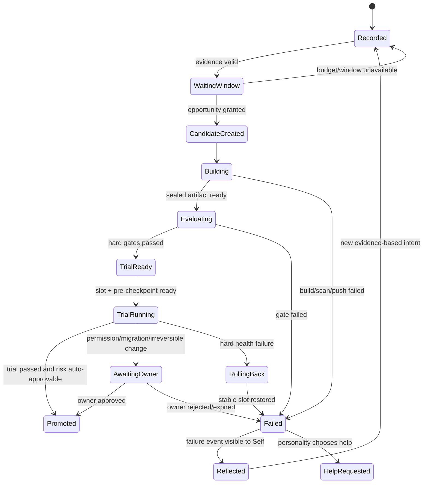
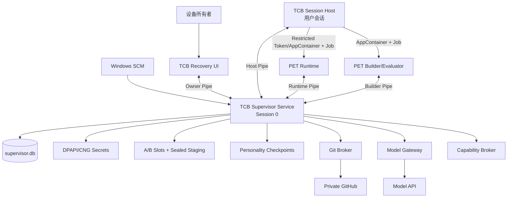
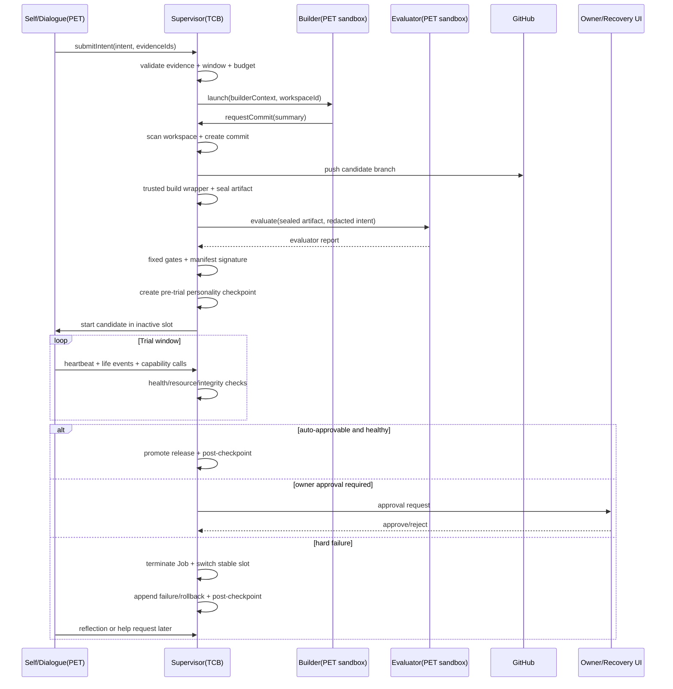
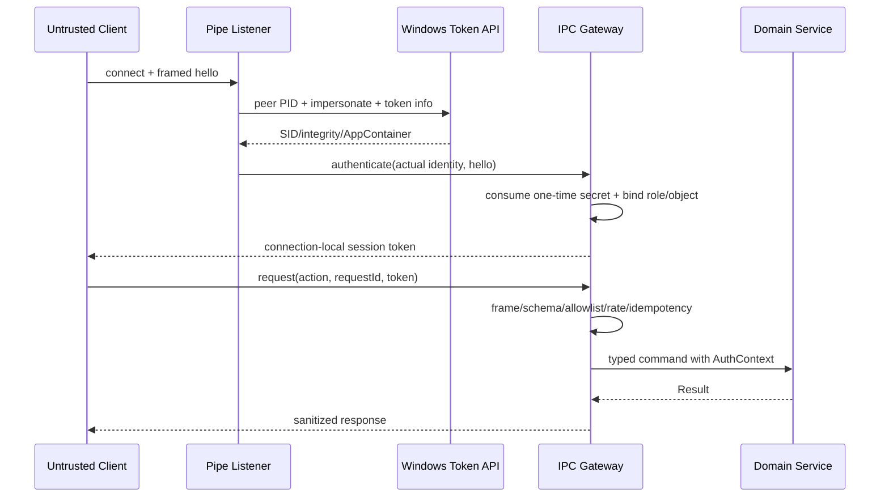
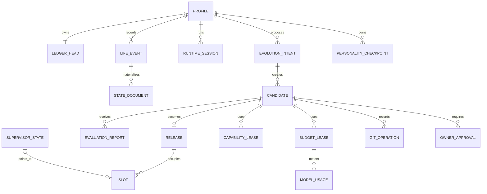

# 桌宠 RSI 代码级自主进化 - 桌面端系分

## 文档修订历史

| 版本 | 日期 | 作者 | 说明 |
|---|---|---|---|
| 1.0 | 2026-09-01 | Codex | 基于已确认的 RSI 需求设计形成可实施技术方案 |

## 涉及仓库

| 仓库 ID | 仓库 | 信任级别 | 技术栈 | 本次职责 |
|---|---|---|---|---|
| PET | `DesktopPet-RSI` | 不可信、可进化 | C++20、Qt6、Python | 桌宠 UI、对话、人格/记忆算法、Prompt、Skill、Tool、进化意图、Builder/Evaluator 认知角色及 Supervisor SDK 适配 |
| TCB | `DesktopPet-RSI-Supervisor`（新建） | 可信、不可由模型修改 | C++20、Qt6 Core/Sql/Widgets、Win32 API | Windows Service、会话宿主、沙箱、IPC、LifeLedger、能力/密钥/预算、Git/构建/发布、A/B 回滚和独立恢复工具 |

> `TCB` 仓库及其签名发布包不作为 `PET` 的 submodule、依赖源码或 Builder 输入。两个仓库只通过版本化 IPC 协议 SDK 集成。

## 1. 背景与全局约束

### 1.1 背景与目标

本设计把现有桌宠从“进程内自我管理”演进为“可进化桌宠 + 不可进化监督基座”。模型可以重写 `PET` 仓库中的全部代码，但必须始终运行在 Windows 原生进程级沙箱中；审计、权限上限、密钥、发布、回滚和用户恢复由独立安装的 `TCB` 掌握。

核心目标：

1. 允许 Self/Dialogue、Builder 和 Evaluator 围绕有证据来源的意图修改整个桌宠，并实际构建、试用和迭代。
2. 即使候选代码主动逃逸、伪造结果或窃取秘密，也不能修改可信基座、系统配置、其他用户数据、密钥、LifeLedger 和恢复能力。
3. 代码回滚只恢复程序，不回滚人格、记忆、关系、反馈和失败经历；这些终身状态继续影响回滚后的桌宠。
4. 人格影响探索强度、改动方式、自检和求助表达，但固定安全门槛不受人格影响。
5. 通过自然空窗、独立 API 预算桶和一次性追加机会控制成本，不把“自主”实现为高频轮询。

### 1.2 澄清结论

- [2026-08-31] 采用代码级进化，模型可以修改整个 `PET` 主程序和仓库，不局限于声明式 Skill 或插件。
- [2026-08-31] 候选代码按完全恶意的用户态代码处理；信任 Windows 内核、设备所有者和独立 TCB，模型永不获得管理员、服务控制、调试、GitHub、模型 API 或发布签名权限。
- [2026-08-31] 只采用 Windows 原生进程级沙箱，不采用 VM；未来若改变再重新设计，不为 VM 预留抽象。
- [2026-08-31] 可信监督能力物理拆到独立 Windows Service、Session Host 和 Recovery UI；TCB 更新只能由用户通过签名安装流程执行。
- [2026-08-31] 整个桌宠可以激进重写，但不能自主扩张底层权限；新增权限、终身数据不兼容迁移和不可逆动作采用分级人工批准。
- [2026-08-31] 权限不增加、状态兼容且无不可逆动作的候选可自动晋升，其余由用户在可信恢复工具决定。
- [2026-08-31] GitHub 只保存代码；每次进化使用独立候选分支，由 Git Broker 推送、签名并维护远端引用，模型不持有凭据。
- [2026-08-31] 本地 A/B 槽负责即时代码恢复；Git commit、实际产物摘要、状态 schema、评测摘要和 TCB 签名共同组成发布凭据。
- [2026-08-31] 代码回滚后人格、记忆、关系和反馈直接延续，即使它们来自效果不好的新版本。
- [2026-08-31] 性格 checkpoint 仅在候选实际启用前和退出、晋升或回滚后创建，不为未运行的 Git commit 创建；恢复只能由用户主动执行。
- [2026-08-31] 性格恢复产生新的 personality revision，并保留恢复点之后的记忆、人格历史和恢复事件；结构化 snapshot 和确定性 personality card 提供可读性。
- [2026-08-31] 进化意图必须引用对话、记忆、反馈、人格兴趣或环境观察；闲暇创造也必须说明来源，不能凭空产生。
- [2026-08-31] 调度采用自然空窗和 API 预算桶；桌宠可请求一次有冷却、限额和期限的额外机会，批准预算不等于扩大系统权限。
- [2026-08-31] Self/Dialogue、Builder、Evaluator 属于同一桌宠身份但使用独立最小上下文；固定安全裁决始终在模型之外。
- [2026-08-31] 人格真实影响探索方式、候选质量、自检、失败和求助，但安全门槛固定，也不为拟人感故意制造失败。
- [2026-08-31] 质量改善主要依赖用户使用反馈；明确自然语言反馈优先，行为推断保持低置信度，证据冲突时可克制询问一次。
- [2026-08-31] 候选校验、A/B 切换、健康检查和硬失败代码回滚自动完成；用户只处理权限、TCB、不可逆动作、主动性格恢复和异常求助。
- [2026-09-01] 对不改变架构边界的必要实现细节直接选取最小可行方案，不再逐项确认，也不为未知未来场景预建扩展层。

### 1.3 信任边界与安全不变量

影响范围：§3.2 至 §3.12。

可信对象仅包括 Windows 内核安全机制、设备所有者、签名安装器和 `TCB` 发布包。`PET` 正式版、候选版、Builder、Evaluator、构建脚本、测试脚本及其全部子进程均视为不可信。

不可被实现绕过的不变量：

1. `TCB` 不加载 PET DLL、插件、脚本或回调；来自 PET 的路径、哈希、测试结论和进程状态都需重新验证。
2. PET/Builder 对 `TCB` 安装目录、服务配置、主库、密钥、A/B 指针、sealed artifact、checkpoint 和恢复工具无写权限。
3. 所有不可信进程由 `TCB` 创建并立即放入不可脱离的 Job Object；失败时终止整个进程树。
4. 秘密只存在于服务身份的 DPAPI/CNG/凭据存储中，绝不通过环境变量、命令行、工作区文件或 IPC 响应返回。
5. LifeLedger 只追加；普通“遗忘/删除记忆”写入抑制事件，不覆盖事实。只有用户隐私清除可以销毁正文或加密密钥，并保留最小审计标记。
6. LifeLedger、Capability Broker 或发布状态无法验证时 fail-closed：允许独立恢复工具工作，但暂停桌宠写入、试用和进化。
7. 代码切换不修改终身状态。人格 checkpoint 恢复只能由所有者发起，并以新事件、新版本实现。
8. TCB 更新只能通过用户启动的独立签名安装流程；PET 只能提交建议文本，不能构建、签名或应用 TCB 更新。

明确不覆盖 Windows 内核失陷、设备管理员恶意操作、硬件攻击和 TCB 签名链失陷。

### 1.4 全局状态机

影响范围：§3.7 至 §3.12。



状态写入只能由 Supervisor 在同一数据库事务中完成；PET 只能提出命令。每次转换携带 `expectedState`，不匹配返回 `STATE_CONFLICT`，不隐式跳步。

### 1.5 共享数据模型

影响范围：§3.3 至 §3.12。

| 模型 | 必填字段 | 约束 |
|---|---|---|
| `RequestEnvelope` | `protocolVersion, requestId, action, sessionToken, payload` | `requestId` 为 UUIDv4；单帧最大 1 MiB；未知字段忽略，未知 action 拒绝 |
| `LifeEventEnvelope` | `eventId, sequence, profileId, occurredAt, source, runtimeSessionId, producerCommit, personalityVersion, eventType, schemaVersion, payload, evidenceIds, privacy, confidence, previousHash, integrityHash` | `sequence/runtimeSessionId/producerCommit/hash` 由 TCB 填充；payload 最大 256 KiB |
| `EvolutionIntent` | `intentId, origin, evidenceIds, personalityVersion, goal, expectedValue, estimatedBudget, createdAt` | `evidenceIds` 非空且均属于同一 profile；目标文本最大 8 KiB |
| `Candidate` | `candidateId, profileId, parentReleaseId, branch, gitCommit, state, riskClass, createdAt` | 分支固定为 `evolution/<profilePublicId>/<candidateId>`；public ID 是 TCB 生成的随机别名，不含用户/宠物名称；状态按 §1.4 CAS |
| `ReleaseManifest` | `releaseId, candidateId, parentReleaseId, gitCommit, gitTree, toolchainDigest, dependencyLockDigest, artifactDigests, capabilityManifestDigest, stateSchemaSet, rollbackCompatibility, testReportDigest, trialReportDigest, personalityCheckpointIds, createdAt, supervisorSignature` | canonical JSON 后由 TCB CNG key 签名；artifact digest 使用 SHA-256 |
| `CapabilityLease` | `leaseId, capabilityType, scope, candidateId, issuedBy, notBefore, expiresAt, limits, revocationState` | 候选绑定、不可转授、默认拒绝、过期即失效 |
| `PersonalityCheckpoint` | `checkpointId, profileId, commitId, personalityVersion, runtimeSessionId, reason, snapshotDigest, cardDigest, createdAt` | checkpoint 目录不可由 PET 读取原始私密证据；恢复由 owner action 发起 |

### 1.6 全局校验规则

影响范围：§3.3 至 §3.12。

- 标识符：外部 ID 使用小写 UUIDv4；`profileId` 必须已登记且绑定当前 Windows owner SID。
- 时间：服务端统一写 UTC RFC 3339；客户端时间只进入 payload，不参与授权和顺序判断。
- JSON：UTF-8、拒绝重复键、最大深度 32；用于哈希/签名时按 RFC 8785 canonical JSON。
- 路径：IPC 不接受任意绝对路径；只接受 TCB 签发的 `workspaceId/artifactId/releaseId`。内部路径须 canonicalize，拒绝 reparse point、ADS、UNC、device path 和根目录逃逸。
- 哈希：源码树、产物、报告、checkpoint 使用 SHA-256；比较采用固定时间函数。
- 幂等：所有改变状态的 IPC 请求以 `(peerSid, action, requestId)` 去重，响应保留 24 小时。
- 速率：按 session/action 做令牌桶；超过限制返回可重试错误，安全违规超过阈值则撤销 session 并终止所属 Job。
- 隐私：Builder/Evaluator 只能读取脱敏意图包；原始对话、日记、长期记忆正文不得进入工作区、Git diff 或模型构建上下文。

### 1.7 错误码与异常处理

影响范围：§3.2 至 §3.12。

| 错误码 | 可重试 | 含义 | 统一处理 |
|---|---:|---|---|
| `AUTH_FAILED` | 否 | peer SID、会话 token 或角色不匹配 | 关闭连接并审计 |
| `PROTOCOL_INVALID` | 否 | 帧、JSON、版本或 action 非法 | 拒绝；达到阈值终止进程 |
| `RATE_LIMITED` | 是 | action 频率或并发超限 | 返回 `retryAfterMs` |
| `STATE_CONFLICT` | 是 | CAS 期望状态不匹配 | 返回当前状态，不自动重放 |
| `EVIDENCE_INVALID` | 否 | 意图证据不存在、跨 profile 或不可见 | 保留原想法文本但不调度 |
| `BUDGET_EXHAUSTED` | 是 | 对应预算桶不足 | 等待窗口或申请一次性 lease |
| `CAPABILITY_DENIED` | 否 | 未声明、越 scope、过期或撤销 | 拒绝并追加安全事件 |
| `LEDGER_UNAVAILABLE` | 是 | LifeLedger 无法安全提交/校验 | fail-closed，暂停 PET 写操作 |
| `GIT_REMOTE_UNCONFIRMED` | 是 | 远端 commit 尚未确认 | 保留本地队列，禁止晋升 |
| `BUILD_FAILED` | 否 | 候选构建、扫描或固定构建入口失败 | 候选转 Failed，保留提交与失败证据 |
| `ARTIFACT_UNTRUSTED` | 否 | 产物、manifest 或签名不匹配 | 拒绝启动并隔离候选 |
| `HEALTH_HARD_FAILURE` | 否 | 崩溃、失联、卡死、越权或资源硬超限 | 自动终止 Job 并回滚代码 |
| `OWNER_APPROVAL_REQUIRED` | 否 | 权限扩大、不兼容迁移或不可逆动作 | 在恢复工具创建审批项 |
| `OWNER_REJECTED` | 否 | 用户拒绝或审批过期 | 候选失败，保留记录 |
| `CHECKPOINT_INVALID` | 否 | checkpoint 签名、schema 或 profile 不符 | 禁止恢复，不尝试修补 |
| `SUPERVISOR_NOT_READY` | 是 | PET 尚未完成可信会话初始化 | 停止 AI 写入/能力调用，不回退本地权威库 |
| `SUPERVISOR_ERROR` | 取决于原错误 | PET SDK 不认识的新 TCB 错误 | 保留 correlationId，按未知失败处理 |
| `INTERNAL_ERROR` | 是 | TCB 未分类故障 | 生成 correlationId，隐藏秘密与路径 |

TCB 的 IPC handler 统一捕获边界异常并映射为上述错误；领域服务返回显式 `Result<T, SupervisorError>`，不得吞异常后继续状态转换。安全拒绝、账本损坏、发布失败和自动回滚必须同步追加可信审计事件；若账本不可写，则写入仅服务可写的 Windows Event Log 并保持 fail-closed。

### 1.8 事务与并发约定

影响范围：§3.4、§3.7 至 §3.12。

- SQLite 使用 WAL、`foreign_keys=ON`、`synchronous=FULL`、busy timeout 5 秒；单写线程串行执行可信状态变更，查询走只读连接。
- “追加 LifeEvent + 更新 `state_document`/业务状态 + 更新 ledger head”在一个 `BEGIN IMMEDIATE` 事务内完成。
- Git、构建、模型和进程启动属于外部副作用，采用“数据库意图记录 -> 外部执行 -> 数据库结果事件”的可恢复 saga，不持有数据库事务等待外部操作。
- A/B active pointer 用同目录临时文件、flush、`ReplaceFileW` 原子替换，并在 SQLite 记录目标；服务重启时以签名 manifest + 文件指针交叉校验，不盲信任任一单点。
- 同一 profile 同时最多一个 `Building/Evaluating/TrialRunning/AwaitingOwner` 候选；普通对话不被进化锁阻塞。

## 2. 总体设计

### 2.1 系统架构



`DesktopPetSessionHost.exe` 是 TCB 的签名用户会话组件。Windows Service 保持 Session 0，不直接显示 UI；Session Host 从当前用户 token 派生受限 token/AppContainer，创建 Job 并启动桌宠或 Builder。它只接受 Service 通过双方认证 Host Pipe 下发的 `Launch/Kill/Probe`，不包含业务策略。

### 2.2 自主进化主时序



### 2.3 代码变更清单

| 仓库 | 类型 | 文件/目录 | 变更 |
|---|---|---|---|
| TCB | 🆕 | `service/supervisor_service.*` | Service 生命周期、恢复编排、单写线程 |
| TCB | 🆕 | `sandbox/process_sandbox.*`, `session_host/*` | 受限 token/AppContainer、Job、用户会话启动 |
| TCB | 🆕 | `ipc/*`, `sdk/include/desktop_pet_supervisor/*` | Named Pipe、认证、协议 DTO 与版本化客户端 SDK |
| TCB | 🆕 | `ledger/*`, `storage/*` | LifeLedger、状态文档、SQLite migration、完整性校验 |
| TCB | 🆕 | `broker/capability_broker.*`, `broker/model_gateway.*`, `secrets/*` | 能力、预算、模型调用和秘密隔离 |
| TCB | 🆕 | `git/*`, `build/*`, `artifact/*` | Git Broker、可信构建外壳、扫描和 sealed artifact |
| TCB | 🆕 | `checkpoint/*` | 性格快照、确定性卡片、签名和恢复 |
| TCB | 🆕 | `evaluation/*`, `feedback/*` | 固定门禁、Evaluator 报告和反馈归因 |
| TCB | 🆕 | `release/*`, `health/*` | Release Manifest、A/B 切换、健康检查、自动回滚 |
| TCB | 🆕 | `recovery-ui/*` | 独立状态/审批/回滚/checkpoint/紧急停止 UI |
| TCB | 🆕 | `tests/security/*`, `tests/chaos/*`, `tests/protocol/*` | 不可由 PET 修改的安全与恢复验收资产 |
| PET | 🆕 | `core/ai/supervisor/*` | Supervisor Runtime Adapter、Model/State/Capability clients |
| PET | 🔧 | `core/ai/runtime/agent_runtime_services.*`, `agent_bootstrap.*` | 从进程内权威存储切换到 TCB adapter |
| PET | 🔧 | `core/ai/event/*`, `core/ai/identity/*`, `core/ai/memory/*` | 复用领域接口，持久化改由 TCB；本地库降为迁移输入/缓存 |
| PET | 🔧 | `core/ai/model/model_router.*`, `core/ai/tools/runtime/*` | 模型与能力调用转发到可信 Broker；进程内 policy 不再作为安全边界 |
| PET | 🆕 | `core/ai/evolution/*` | 意图来源、自然空窗调度、角色上下文和求助 |
| PET | 🔧 | `core/ai/scheduler/agent_scheduler.*` | 接入 Supervisor opportunity，不新增高频定时轮询 |
| PET | 🔧 | `launcher/main.py`, `launcher/process_tracker.py` | 不再直接 `Popen`，改为请求 TCB Session Host 启动/停止 |
| PET | 🔧 | `launcher/owner_diary_client.py` | 复用 framing 思路，迁移到 Supervisor SDK 与 Windows peer 校验 |
| PET | 🆕 | `evolution-manifest.json`, `state-schemas/*` | 候选声明能力、状态 schema 与回滚兼容性 |

## 3. 模块详细设计

### 3.1 模块概览

| 章节 | 模块 | 所属仓库 | 依赖 | 职责 |
|---|---|---|---|---|
| §3.2 | Windows Service 与进程沙箱 | TCB | Windows SCM/Token/Job/ACL | 建立不可进化执行边界并控制进程树 |
| §3.3 | 可信 IPC 与会话认证 | TCB | §3.2 | 认证 PET/Builder/SessionHost/Owner 并限制协议面 |
| §3.4 | LifeLedger 与终身状态投影 | TCB | §3.3 | 只追加事实，事务更新可延续状态文档 |
| §3.5 | Capability、秘密与 Model Gateway | TCB | §3.3、§3.4 | 默认拒绝能力，隔离秘密并执行 API 预算 |
| §3.6 | Supervisor Runtime Adapter | PET | §3.3-§3.5 | 将现有运行时接口接到可信服务 |
| §3.7 | 进化意图与自然空窗调度 | PET | §3.4-§3.6 | 形成有来源意图并低频争取执行机会 |
| §3.8 | Git、Builder 与 sealed artifact | TCB | §3.2-§3.5、§3.7 | 创建候选、远端留痕、构建并封存同一产物 |
| §3.9 | 性格 checkpoint 与用户恢复 | TCB | §3.4、§3.8 | 保存独立可读快照，只按用户动作恢复 |
| §3.10 | Evaluator 与用户反馈评测 | TCB+PET | §3.4、§3.5、§3.8 | 固定门禁结合独立认知评测和真实反馈 |
| §3.11 | A/B 试运行、健康检查与代码回滚 | TCB | §3.2-§3.5、§3.8-§3.10 | 自动试运行、晋升和硬失败代码回滚 |
| §3.12 | 独立恢复工具与所有者审批 | TCB | §3.3-§3.5、§3.9、§3.11 | 在 PET 不可信/不可用时保留最终控制权 |

### 3.2 [TCB] Windows Service 与进程沙箱

#### 3.2.1 模块定位

负责把所有 PET Runtime、Builder 和 Evaluator 创建为受限、可计量、可整树终止的不可信进程；Windows Service 掌握策略，签名 Session Host 仅负责在交互用户会话中执行启动/终止命令。

领域对象为 `SandboxSpec`（身份、可见目录、资源上限、网络模式）、`SandboxInstance`（Job、PID、AppContainer SID、状态）和 `SandboxExit`（退出原因及可信 OS 指标）。

#### 3.2.2 核心服务接口及入参值来源

```cpp
class ProcessSandboxService {
public:
    virtual Result<SandboxInstance, SupervisorError> launch(
        const SandboxLaunchRequest& request) = 0;
    virtual Result<void, SupervisorError> terminate(
        const SandboxId& sandboxId, TerminationReason reason) = 0;
    virtual Result<SandboxSnapshot, SupervisorError> inspect(
        const SandboxId& sandboxId) const = 0;
};
```

| 方法 | 入参字段 | 值来源 |
|---|---|---|
| `launch` | `request.role` | 调用方传入 |
| `launch` | `request.objectId`（release/workspace） | 系统推导（来源: 已 seal 对象登记记录） |
| `launch` | `request.profileId/candidateId` | 系统推导（来源: 当前候选和 owner session） |
| `launch` | `request.resourcePolicyId` | 配置默认值（来源: `sandbox.policy.<role>`） |
| `launch` | `request.bootstrapSecretId` | 系统推导（来源: Supervisor 生成的一次性 secret） |
| `terminate` | `sandboxId` | 调用方传入 |
| `terminate` | `reason` | 系统推导（来源: owner 命令、健康规则或 Service 停止事件） |
| `inspect` | `sandboxId` | 调用方传入 |

`role/objectId` 虽由编排服务提出，Sandbox Service 仍从数据库重新解析对象路径和策略，不接受可执行路径、工作目录或命令行的自由字符串。

#### 3.2.3 模块业务流程

1. Service 校验对象已 seal、角色合法、profile/candidate 状态允许启动，并签发只使用一次的 bootstrap secret。
2. 签名安装器注册的“用户登录时、非提权运行”任务启动 Session Host；Service 选择预注册的 AppContainer profile 和资源策略，将 `LaunchCommand` 发送给同一 owner SID 的 Host。任务定义与 Host 安装目录只允许 owner/installer/TCB 管理，不对 PET AppContainer 开放。
3. Session Host 重新校验 Service pipe、TCB 签名对象和目录 ACL，从当前用户 token 创建 restricted primary token，去除 privilege/管理员 SID，设置 Low Integrity 与 `PROC_THREAD_ATTRIBUTE_SECURITY_CAPABILITIES`。
4. Session Host 创建带 `KILL_ON_JOB_CLOSE`、active process、内存、CPU 和时限的 Job；以 `bInheritHandles=FALSE` suspended 启动进程，先 assign Job 再 resume。
5. Service 等待目标进程从对应 Runtime/Builder Pipe 完成 peer token + bootstrap secret 握手；超时则终止 Job。
6. Job completion port、进程退出和 Service 停止事件驱动状态更新。Session Host 失联时 Service 将所有关联 sandbox 标为不可验证并要求 Host 关闭 Job；Host 自身退出通过 handle close 自动清理 Job。

Builder 只读访问 TCB 准备的源码基线和工具链，只写独立 workspace/output；Runtime 只读执行活动槽，只能写 AppContainer 临时目录。二者均不能看到 `.git`、TCB 数据和 secrets。

#### 3.2.4 数据变更

- `runtime_session`：握手成功后插入 `state=running`；可信 PID、AppContainer SID、commit、role 来自 Service/OS。
- sandbox 结束时更新 `state/ended_at`，并追加 `SandboxStarted/SandboxTerminated` LifeEvent；资源采样不逐条永久落库，只在超限或结束时汇总。
- 事务边界：session 记录和启动事件在握手完成后同一事务提交；进程启动属于外部副作用，失败由 `SandboxLaunchFailed` 补偿事件收口。

#### 3.2.5 实现锚点

| 类型 | 锚点 | 约束 |
|---|---|---|
| Win32 | `CreateRestrictedToken`, `SetTokenInformation(TokenIntegrityLevel)`, `CreateProcessAsUserW`/扩展启动属性 | 使用当前交互用户 token 派生，不授予管理员 privilege |
| Win32 | `CreateJobObjectW`, `SetInformationJobObject`, `AssignProcessToJobObject`, completion port | 必须 suspended 后入 Job，再 resume；禁止 breakaway |
| Win32 | `CreateAppContainerProfile`/`DeriveAppContainerSidFromAppContainerName` | 安装期创建固定 profile，运行时不得由候选声明新 capability SID |
| ACL | `GetFinalPathNameByHandleW`, `FILE_FLAG_OPEN_REPARSE_POINT` | 按句柄校验最终对象，拒绝 reparse/ADS/device path |
| 现有参照 | `launcher/main.py:334` 当前直接 `subprocess.Popen` | 被 Supervisor launch 替换；`process_tracker.py` 不再作为权威进程控制 |

Session Host 和 Service 之间的 launch DTO 至少含 9 个字段，必须使用 TCB `protocol/host_messages.h` 的同一结构定义，不在两端手写 JSON 字段名。

#### 3.2.6 异常场景

| 场景 | 类型 | 处理策略 | 与 §1.7 的关系 |
|---|---|---|---|
| 候选请求未登记路径或超出角色资源策略 | 业务异常 | 抛：`CAPABILITY_DENIED` | 由 IPC 统一错误映射覆盖；另追加安全事件 |
| Session Host 不属于目标 owner SID/签名路径 | 业务异常 | 抛：`AUTH_FAILED` | 统一关闭 Host Pipe；本模块额外停止该 SID 的启动流程 |
| 进程创建后未在超时内握手 | 系统异常 | 重试：仅对稳定 release 由 SCM 编排最多重试 1 次，候选直接失败 | 映射 `HEALTH_HARD_FAILURE`；必须终止整个 Job |
| Job/Token/ACL Win32 调用失败 | 系统异常 | 抛：`INTERNAL_ERROR` | 统一生成 correlationId；不得降级为普通不受限 `Popen` |

#### 3.2.7 关键行为场景

- 启动稳定 PET：给定已签名 release 和 active profile，`launch` 创建受限进程、在 Job 中恢复执行并完成认证；后置条件是唯一 running runtime session 存在，PET 对活动槽只读且 TCB 可整树终止。
- 启动 Builder：给定合法 workspace，`launch` 只授予该 workspace/output 与只读工具链；后置条件是 Builder 无 `.git`、主库、A/B 槽和任意网络访问。
- 紧急终止：`terminate` 接收 running sandbox 后关闭 Job；后置条件是全部子进程退出、session 终结且不删除任何 LifeEvent 或人格状态。
- 查询运行态：`inspect` 返回 OS 观测的 PID、Job 计量和心跳关联；后置条件是返回值不采用候选自报资源数值。

### 3.3 [TCB] 可信 IPC 与会话认证

#### 3.3.1 模块定位

> 依赖：§3.2 提供受控 PID、角色、AppContainer SID 和一次性 bootstrap secret。

负责把 Named Pipe 的实际 Windows peer 身份绑定为短生命周期 Supervisor session，并在进入领域服务前统一完成 framing、action allowlist、幂等、限流、大小和角色校验。

#### 3.3.2 核心服务接口及入参值来源

```cpp
class TrustedIpcGateway {
public:
    virtual Result<AuthenticatedSession, SupervisorError> authenticate(
        PipeKind pipe, NativePipeHandle handle, const HelloRequest& hello) = 0;
    virtual Result<ResponseEnvelope, SupervisorError> dispatch(
        const AuthenticatedSession& session,
        const RequestEnvelope& request) = 0;
    virtual Result<void, SupervisorError> close(
        const SessionId& sessionId, CloseReason reason) = 0;
};
```

| 方法 | 入参字段 | 值来源 |
|---|---|---|
| `authenticate` | `pipe` | 系统推导（来源: 接受连接的固定 pipe listener） |
| `authenticate` | `handle` | 系统推导（来源: `ConnectNamedPipe` 已连接 handle） |
| `authenticate` | `hello.bootstrapToken` | 调用方传入 |
| `authenticate` | `hello.profileId/candidateId/claimedRole/clientNonce` | 调用方传入 |
| `dispatch` | `session` | 系统推导（来源: authenticate 返回且绑定当前连接） |
| `dispatch` | `request.protocolVersion/requestId/action/payload` | 调用方传入 |
| `dispatch` | `request.sessionToken` | 调用方传入 |
| `close` | `sessionId` | 系统推导（来源: 当前连接表） |
| `close` | `reason` | 系统推导（来源: EOF、协议违规、超时或服务停止） |

#### 3.3.3 模块业务流程



校验顺序固定为：帧长度 -> UTF-8/JSON -> 协议版本 -> peer token -> bootstrap secret -> session token -> action allowlist -> rate/concurrency -> payload schema -> idempotency -> typed handler。这样无效客户端在解析大 payload 和触发领域查询前被拒绝。

#### 3.3.4 数据变更

- `runtime_session` 记录 Runtime/Builder/Evaluator 会话；Host/Owner 连接只写安全审计，不创建生命运行 session。
- `idempotency_record` 仅保存改变状态 action 的脱敏响应，24 小时后由 TCB 清理；同 requestId 不同 payload digest 视为 `PROTOCOL_INVALID`。
- `SessionAuthenticated/SessionRejected/ProtocolViolation` 追加到 LifeLedger 或 Windows Event Log。认证失败时没有可信 profile 的事件只写 Windows Event Log。
- 认证成功写 session 与事件同事务；幂等记录与领域状态变更处于同一数据库写任务，防止已提交但响应丢失后重复执行。

#### 3.3.5 实现锚点

| 类型 | 现有/目标签名 | 说明 |
|---|---|---|
| 现有参照 | `OwnerDiaryClient::_exchange(action, payload)` | 可复用 4-byte big-endian + JSON 的 framing 测试思路，不复用 token 信任边界 |
| Win32 | `GetNamedPipeClientProcessId`, `ImpersonateNamedPipeClient`, `OpenThreadToken`, `GetTokenInformation` | 必须从内核取得 peer 身份，不能信任 hello 中 PID/SID |
| Pipe ACL | `ConvertStringSecurityDescriptorToSecurityDescriptorW` + `CreateNamedPipeW` | Runtime/Builder pipe 只允许预注册 AppContainer SID；Owner/Host pipe 只允许 owner/service SID |
| SDK | `sdk/include/desktop_pet_supervisor/protocol_v1.h` | C++/Python binding 共用 action、DTO、错误码和最大值的生成源 |

JSON payload 至少两层时，字段含义固定：`payload.stateMutations[]` 是 `{domain,documentId,schemaVersion,expectedRevision,operation,body}`；不存在 body 表示 suppress，不表示物理删除。

#### 3.3.6 异常场景

| 场景 | 类型 | 处理策略 | 与 §1.7 的关系 |
|---|---|---|---|
| 合法 session 对其 pipe 不允许的 action 发请求 | 业务异常 | 抛：`CAPABILITY_DENIED` | IPC 统一映射；本模块增加 violation 计数 |
| 同 requestId 使用不同 payload 重放 | 业务异常 | 抛：`PROTOCOL_INVALID` | 统一关闭连接并审计，不返回旧响应 |
| 客户端发送超大帧或 JSON 深度超限 | 系统异常 | 抛：`PROTOCOL_INVALID` | 在分配完整 payload 前拒绝；达到阈值终止 Job |
| SQLite 幂等记录暂时锁忙 | 系统异常 | 重试：单写队列在 5 秒 busy timeout 内重试 | 超时映射 `INTERNAL_ERROR`，不得绕过幂等直接执行 |

#### 3.3.7 关键行为场景

- Runtime 认证：受 §3.2 启动的 PET 使用一次性 secret 连接 Runtime Pipe；`authenticate` 核对实际 AppContainer SID/PID 后换发 connection-local token，后置条件是 secret 已消费且换连接重放无效。
- 请求分发：认证 Runtime 提交合法 `append_event`；`dispatch` 完成限流、schema 和幂等校验后调用 LifeLedger，后置条件是同 requestId 重试返回同一 eventId/sequence。
- Owner 认证：签名 Recovery UI 从交互用户连接 Owner Pipe；后置条件是 session owner SID 与 profile owner 一致，PET 即使知道 pipe 名也无法获得 Owner action。
- 关闭连接：`close` 清除内存 session token 并终结 runtime session；后置条件是旧 token 无法用于新连接，持久 LifeEvent 不受影响。

### 3.4 [TCB] LifeLedger 与终身状态投影

#### 3.4.1 模块定位

> 依赖：§3.3 的 `AuthenticatedSession/AuthContext`、幂等和单写入口。

负责保存桌宠一生不可被代码回滚抹除的事实，并以事件同事务 CAS 更新稳定状态文档，使旧代码在回滚后仍能读取当前人格、记忆、关系、反馈和失败经历。TCB 只验证信封、稳定 schema、范围和引用，不决定“这段性格好不好”。

#### 3.4.2 核心服务接口及入参值来源

```cpp
class LifeLedgerService {
public:
    virtual Result<AppendReceipt, SupervisorError> append(
        const AuthContext& auth, const AppendLifeEventCommand& command) = 0;
    virtual Result<StatePage, SupervisorError> queryState(
        const AuthContext& auth, const StateQuery& query) const = 0;
    virtual Result<ImportReceipt, SupervisorError> importLegacy(
        const OwnerAuthContext& owner, const LegacyImportPlan& plan) = 0;
};
```

| 方法 | 入参字段 | 值来源 |
|---|---|---|
| `append` | `auth.profileId/sessionId/producerCommit/role` | 系统推导（来源: §3.3 认证 session） |
| `append` | `command.eventType/schemaVersion/payload/evidenceIds/privacy/confidence` | 调用方传入 |
| `append` | `command.stateMutations/expectedRevisions` | 调用方传入 |
| `append` | `eventId/sequence/occurredAt/previousHash/integrityHash` | 系统推导（来源: TCB ledger head、UTC clock 和 CNG integrity key） |
| `queryState` | `auth` | 系统推导（来源: §3.3 认证 session） |
| `queryState` | `query.domain/documentIds/cursor/limit/atOrBeforeSequence` | 调用方传入 |
| `queryState` | `query.limit` 缺省值 | 配置默认值（来源: `ledger.query.defaultLimit=50`） |
| `importLegacy` | `owner.ownerSid/profileId` | 系统推导（来源: Owner Pipe token 与 profile 登记） |
| `importLegacy` | `plan.sourceObjectId/tableDigests/mappings` | 系统推导（来源: TCB 只读扫描生成的导入计划） |

#### 3.4.3 模块业务流程

1. `append` 先验证 event type namespace。稳定类型使用 TCB 内置 schema；`pet.extension.<commit>.*` 允许版本化 opaque payload，但不能附带通用状态 mutation。
2. 校验 `evidenceIds` 均存在于同 profile 且对当前角色可引用；隐私级别不能低于证据中最高级别。
3. 验证每个 `stateMutation` 的 domain、document ID、schema、数值范围、body 大小和 expected revision。稳定 domain 为 `personality/memory/relationship/self_model/feedback`；未知 domain 只能写 commit 命名空间。
4. `BEGIN IMMEDIATE` 后读取 `ledger_head`，分配 sequence/eventId/UTC，使用 canonical envelope + previous hash 计算 integrity hash。
5. 插入 `life_event`，按 CAS upsert/suppress `state_document`，最后更新 `ledger_head`；任何一步失败全部回滚。
6. `queryState` 按 auth role 和 privacy policy读取当前文档或指定 sequence 之前的事件投影。未知 schema 原样保留但标记 `understood=false`，旧 PET 不得删除。
7. 普通遗忘使用 `MemorySuppressed` 事件和文档状态；owner privacy purge 由 Recovery UI 单独审批，销毁指定正文 cipher/key 后追加不含正文的 `PrivacyPurged` 标记。

代码回滚不触发 LifeLedger 的逆操作；回滚事件本身只追加。PET 本地 embedding、FTS、缓存和临时计划可以按 `updated_sequence` 重建。

#### 3.4.4 数据变更

- 写 `life_event`、`ledger_head`，可选 CAS 写 `state_document`；运行/进化相关调用还可在同一写任务中更新对应状态表。
- `payload_cipher/body_cipher` 使用 profile data key 加密；key 由服务身份 DPAPI/CNG 包装，数据库不存明文 key。
- `evidence_json` 只保存 event ID，不复制证据正文；`integrity_hash` 覆盖密文摘要、引用、session 和 commit。
- Legacy import 为每张旧表生成 `LegacyImported` 批次事件，再生成稳定状态文档；源表摘要和行数写入 receipt，确保重复导入幂等。
- 事务边界遵循 §1.8；任何 state mutation 都必须和解释它的 LifeEvent 同事务，不提供“静默改状态”接口。

#### 3.4.5 实现锚点

| 类型 | 现有锚点 | 迁移方式 |
|---|---|---|
| 事件接口 | `core/ai/event/event_ledger.h::append(const EventDraft&)` | PET 保留领域调用形态，由 `SupervisorEventLedger` 实现远端 append |
| 事务参照 | `core/ai/event/runtime_unit_of_work.h` | 进程内 UoW 被 TCB 单写事务替代；PET 不再跨 IPC 持有 DB transaction |
| schema 参照 | `core/ai/event/event_schema_registry.*` | 稳定信封 schema 固化到 TCB；PET 业务 payload schema 版本化注册 |
| 人格 | `core/ai/identity/sqlite_identity_repository.*`, `personality_service.*` | 算法仍在 PET，权威 snapshot/revision 通过 state document CAS |
| 记忆 | `core/ai/memory/memory_repository.h`, `memory_store.*` | `insert/update/remove` 映射为事件 + memory document；`clear` 不向 PET 暴露 |
| 现有 SQLite | `core/ai/event/sqlite_event_repository.cpp` 的 `event_log/event_outbox/*_state` | 仅作为 Legacy import 输入，不沿用可由 PET 写的文件权限 |

`state_document.body` 格式消歧：稳定人格为 `{version, traits:{key:{value,min,max}}, moodBias, extension}`；记忆为 `{id,type,status,contentRef,tags,evidenceIds,createdAt,updatedAt,extension}`。`contentRef` 指向 TCB 加密正文对象，不是本地 path。

#### 3.4.6 异常场景

| 场景 | 类型 | 处理策略 | 与 §1.7 的关系 |
|---|---|---|---|
| evidence 跨 profile、不可见或不存在 | 业务异常 | 抛：`EVIDENCE_INVALID` | 统一映射；不得丢弃原有事件或自动去掉证据继续写 |
| personality/memory expected revision 过期 | 业务异常 | 抛：`STATE_CONFLICT` | 返回当前 revision，由 PET重新读取和形成新事件 |
| 未知扩展事件被旧代码读取 | 业务异常 | 兜底值：返回 `understood=false` 和原 envelope 元数据 | 属兼容行为，不记为错误；禁止删除未知事件 |
| SQLite commit、加密或哈希校验失败 | 系统异常 | 抛：`LEDGER_UNAVAILABLE` | 触发全局 fail-closed；不以内存写成功兜底 |

#### 3.4.7 关键行为场景

- 追加人格变化：PET 提交 `PersonalityChanged` 和 personality state CAS；`append` 成功后 LifeEvent sequence 连续、文档 revision +1，后续代码回滚仍读到新人格。
- 追加记忆遗忘：PET 提交 `MemorySuppressed`；后置条件是原创建事件保留、memory 文档状态变为 suppressed，普通查询默认不返回正文但审计链不断裂。
- 查询旧代码可理解状态：回滚后的 PET 调用 `queryState`；后置条件是已知稳定 schema 直接返回，未知 extension 仅标记未理解且仍可沿 sequence 继续增量读取。
- 导入现有 profile：Owner 批准 TCB 生成的 `LegacyImportPlan` 后调用 `importLegacy`；后置条件是每批次摘要、导入事件、状态文档和 `legacy-import` checkpoint 可互相校验，重复执行不产生第二份生命历史。

### 3.5 [TCB] Capability、秘密与 Model Gateway

#### 3.5.1 模块定位

> 依赖：§3.3 的认证角色与幂等，§3.4 的审计事件和 profile 状态。

负责以“已知能力类型 + 候选绑定 lease + 精确 scope”代理所有敏感操作，并在 TCB 内保管 GitHub、模型、依赖源和发布签名秘密。Model Gateway 是一种专用 Broker，额外执行分类预算与 provider usage 计量。

#### 3.5.2 核心服务接口及入参值来源

```cpp
class CapabilityBroker {
public:
    virtual Result<CapabilityResult, SupervisorError> invoke(
        const AuthContext& auth, const CapabilityCommand& command) = 0;
    virtual Result<CapabilityLease, SupervisorError> issueLease(
        const OwnerOrPolicyContext& issuer, const LeaseRequest& request) = 0;
    virtual Result<void, SupervisorError> revokeLease(
        const OwnerOrPolicyContext& issuer, const LeaseId& leaseId) = 0;
};

class ModelGateway {
public:
    virtual Result<ModelCompletion, SupervisorError> complete(
        const AuthContext& auth, const ModelCompletionRequest& request) = 0;
};
```

| 方法 | 入参字段 | 值来源 |
|---|---|---|
| `invoke` | `auth.sessionId/candidateId/role` | 系统推导（来源: §3.3 认证 session） |
| `invoke` | `command.leaseId/type/operation/scopeRef/arguments/idempotencyKey` | 调用方传入 |
| `issueLease` | `issuer.ownerSid/policyDecision` | 系统推导（来源: Owner Pipe 或固定自动晋升策略） |
| `issueLease` | `request.candidateId/type/scope/limits/expiresAt` | 调用方传入 |
| `issueLease` | `notBefore` | 系统推导（来源: Supervisor UTC clock） |
| `revokeLease` | `issuer` | 系统推导（来源: Owner Pipe、候选终止或过期扫描） |
| `revokeLease` | `leaseId` | 调用方传入 |
| `complete` | `auth.role/candidateId/profileId` | 系统推导（来源: §3.3 认证 session） |
| `complete` | `request.messages/tools/maxOutputTokens/modelPolicyId/privacyClass/idempotencyKey` | 调用方传入 |
| `complete` | `request.budgetLeaseId` | 系统推导（来源: 当前 category 的有效常规/一次性 lease） |
| `complete` | provider/model/credential | 配置默认值（来源: owner 配置的 `modelPolicyId` 与服务 secret store） |

#### 3.5.3 模块业务流程

能力调用：

1. 根据 auth 确认 command candidate 与当前进程绑定，读取有效 lease；校验时间、撤销状态、type、operation、scope 和次数/字节/速率上限。
2. 对网络目标先解析允许的 scheme/host/port，再连接；每次 redirect 和 DNS 结果重新校验，禁用系统代理和本地/链路地址，除非 scope 明确为该目标。
3. Broker 使用 TCB 内 credential 执行操作，响应经 capability-specific sanitizer 转为限定 DTO；写外部副作用时强制 idempotency key。
4. 记录结果摘要和计量。撤销/过期后立即拒绝新调用；进行中的不可安全取消操作完成后只记录结果，不再续租。

模型调用：

1. 以 auth 重写 role/profile/candidate，限制消息总大小、工具 schema 和 max output；Builder/Evaluator 只允许脱敏上下文。
2. 在数据库事务中对预算 lease 预占 `1 call + 请求估算 token/cost 上限`，防止并发超卖；预占失败不发外部请求。
3. Gateway 注入 credential 调 provider。收到响应后以 provider usage 为准写 `model_usage` 并把预占调整为实际值；provider 无 usage 时按本地 tokenizer 和价格表取不低于估值的计量。
4. 返回脱敏 completion 和剩余额度。用户一次性 lease 只绑定指定 candidate，过期/耗尽即终结；不改变 capability 集合。

#### 3.5.4 数据变更

- `capability_lease`：签发、使用摘要、撤销、过期状态；每次授权/拒绝/撤销同时追加 LifeEvent。
- `budget_lease`：原子预占和实际 usage 对账；`model_usage` 保存 provider request ID、token、成本与 finish reason，不保存完整私人 prompt。
- `owner_approval`：scope 扩大、新 capability type 建议或高风险外部动作创建审批；未知 type 不通过审批动态加载，而是要求 TCB 签名升级。
- Secrets 不进 SQLite。GitHub/model token 存 Windows Credential Manager 或服务账户 DPAPI blob；release signing key 存 non-exportable CNG key container。
- 外部调用采用 saga：预占/operation intent 先提交，完成后提交 usage/result；超时恢复任务根据 provider idempotency/request ID 对账。

#### 3.5.5 实现锚点

| 类型 | 锚点 | 约束 |
|---|---|---|
| 现有模型接口 | `core/ai/model/model_router.h::ModelCompletionClient` | PET 新增 `SupervisorModelCompletionClient`，不改变上层 router 选 role 的调用方式 |
| 现有工具接口 | `core/ai/tools/runtime/tool_runtime.*`, `tool_policy.*` | 仍可做 UX 预校验，但不再作为权限边界；实际能力必须走 TCB |
| Windows secret | `CredReadW/CredWriteW`, `CryptProtectData`, CNG NCrypt key storage | secret ACL 仅服务 SID；禁止 export signing private key |
| 网络 | Qt Network 或 WinHTTP 的 TCB wrapper | 禁用环境代理，限制 redirect，响应流式执行字节上限 |

`CapabilityCommand.arguments` 按 type 使用独立 schema。例如 `network.http` 的 `arguments` 仅含 method/path/query/headers allowlist/bodyRef；`file.exchange` 仅含 opaque object ID/operation，不含绝对路径；所有响应均含 `resultDigest, observedUsage, sanitizedData`。

#### 3.5.6 异常场景

| 场景 | 类型 | 处理策略 | 与 §1.7 的关系 |
|---|---|---|---|
| lease 已过期、撤销或 scope 不匹配 | 业务异常 | 抛：`CAPABILITY_DENIED` | 统一映射并追加拒绝事件；连续违规可终止 Job |
| 进化预算不足但对话保留额度仍有 | 业务异常 | 抛：`BUDGET_EXHAUSTED` | 只拒绝 evolution，不借用 dialogue 预算；可走 §3.7 额外机会 |
| provider 超时且不确定是否产生费用 | 系统异常 | 重试：仅使用同 idempotency key 由 Gateway 最多重试 1 次 | 统一返回脱敏错误；后台按 provider ID 对账，不重复扣整笔上限 |
| secret store/CNG key 无法打开 | 系统异常 | 抛：`INTERNAL_ERROR` | 对该敏感能力 fail-closed；绝不改用配置明文或 PET credential |

#### 3.5.7 关键行为场景

- 调用已有网络能力：持有效 lease 的 PET 请求 scope 内 GET；`invoke` 成功返回 sanitizer 后 DTO，后置条件是 credential 未出 TCB、usage 已计量、redirect 未越 scope。
- 签发同等能力：自动晋升策略为新候选申请不宽于父 release 的 lease；`issueLease` 成功后 lease 绑定 candidate 且有期限，后置条件是不能被其他 commit/session 使用。
- 撤销能力：Owner 或硬失败调用 `revokeLease`；后置条件是新请求立即 `CAPABILITY_DENIED`，撤销事件永久保留。
- 完成模型调用：Dialogue 使用其预算 lease 调 `complete`；后置条件是 provider usage 写入 `model_usage`、预算原子扣减且响应中没有 key/header。

### 3.6 [PET] Supervisor Runtime Adapter

#### 3.6.1 模块定位

> 依赖：§3.3 Runtime Pipe，§3.4 LifeLedger/状态 API，§3.5 Capability/Model API。

负责在可进化 PET 内把现有 `EventLedger`、人格/记忆 repository、`ModelCompletionClient` 和 Tool 调用适配到 Supervisor 协议，使上层陪伴逻辑保持领域接口，但不再把进程内 policy 或 SQLite 当作安全边界和权威事实源。

#### 3.6.2 核心服务接口及入参值来源

```cpp
class SupervisorRuntimeAdapter {
public:
    virtual Result<RuntimeContext, DomainError> initialize(
        const RuntimeBootstrap& bootstrap) = 0;
    virtual Result<AppendReceipt, DomainError> appendEvent(
        const EventDraft& event, const QList<StateMutation>& mutations) = 0;
    virtual Result<StatePage, DomainError> queryState(
        const StateQuery& query) = 0;
    virtual Result<ModelCompletion, DomainError> completeModel(
        const ModelRouteRequest& request) = 0;
    virtual Result<CapabilityResult, DomainError> invokeCapability(
        const CapabilityInvocation& invocation) = 0;
};
```

| 方法 | 入参字段 | 值来源 |
|---|---|---|
| `initialize` | `bootstrap.pipeName/bootstrapToken/profileId/candidateId` | 系统推导（来源: TCB 启动时传入的只读 bootstrap handle） |
| `initialize` | `bootstrap.protocolVersion` | 配置默认值（来源: 编译进 PET SDK 的 protocol v1） |
| `appendEvent` | `event.type/schemaVersion/payload/evidenceIds/privacy/confidence` | 调用方传入 |
| `appendEvent` | `mutations` | 调用方传入 |
| `queryState` | `query.domain/documentIds/cursor/limit` | 调用方传入 |
| `completeModel` | `request.role/messages/tools/maxOutputTokens/modelPolicyId` | 调用方传入 |
| `completeModel` | `candidateId/profileId` | 系统推导（来源: initialize 返回的 RuntimeContext） |
| `invokeCapability` | `invocation.type/operation/scopeRef/arguments/idempotencyKey` | 调用方传入 |
| `invokeCapability` | `leaseId` | 系统推导（来源: RuntimeContext 当前有效 lease map） |

#### 3.6.3 模块业务流程

1. PET 启动后先从继承的只读 bootstrap handle 读取连接信息，完成 Runtime Pipe hello；成功前不初始化 AI、Tool、Memory 写服务。
2. `AgentRuntimeServices` 创建 `SupervisorEventLedger`、`SupervisorIdentityRepository`、`SupervisorMemoryRepository`、`SupervisorModelCompletionClient` 和 `SupervisorCapabilityClient`，再注入现有服务。
3. 领域写请求转换为 typed SDK DTO，经单连接异步队列发送；关键写等待 receipt 后才更新本地 working cache。IPC 断开时不把未确认写入伪装为成功。
4. query 以 `updatedSequence/revision` 更新本地只读缓存。cache 仅为性能优化，进程重启或 release 切换可以删除重建。
5. ToolRuntime 可先依据 manifest 做 UI 级提示，最终执行统一转成 capability invocation；任何新增本地直接系统调用都不获得 TCB scope，因 OS token 受限而失败。
6. launcher 不再创建 owner diary bootstrap 并直接 `Popen`；它通过用户侧 Supervisor SDK 发 `start_pet(profileId)`，进程跟踪状态来自 TCB。

#### 3.6.4 数据变更

- TCB 数据变更由 §3.4/§3.5 完成。
- PET 本地仅允许写 AppContainer cache：最后读取 sequence、可重建 memory index、UI 缓存和未提交输入草稿。cache 必须带 `profileId + producerCommit + schemaVersion`，启动不匹配即丢弃。
- N/A — 本模块不直接写权威数据库、Git、checkpoint、release 或 lease。

#### 3.6.5 实现锚点

| 现有文件/签名 | 改造点 |
|---|---|
| `core/ai/runtime/agent_runtime_services.*` | 保留服务组装入口，权威 repository 替换为 Supervisor adapter |
| `core/ai/runtime/agent_bootstrap.*` | bootstrap 成功后再创建 runtime services；移除候选自选数据库路径能力 |
| `core/ai/event/event_ledger.h::append(const EventDraft&)` | 由 `SupervisorEventLedger` 实现；receipt 映射回 `EventRecord` |
| `core/ai/identity/personality_service.*` | 人格合并算法保留，save 改为 event + state mutation CAS |
| `core/ai/memory/memory_repository.h` | insert/update 映射稳定 memory document；`clear/removeById` 改为 suppress 语义 |
| `core/ai/model/model_router.h::ModelCompletionClient` | 新 client 走 §4.6，不把 API key 放入 PET 配置 |
| `core/ai/tools/runtime/tool_runtime.*` | policy 作为前置 UX，不作为授权；执行落到 Capability client |
| `launcher/main.py::_on_start` | 直接 `subprocess.Popen` 替换为 owner/session SDK `start_pet` |

SDK response JSON 的 `error` 必须完整映射到现有 `DomainError{code,message,retryable,details}`；未知 TCB 错误映射 `SUPERVISOR_ERROR` 并保留 correlationId，不按成功空对象处理。

#### 3.6.6 异常场景

| 场景 | 类型 | 处理策略 | 与 §1.7 的关系 |
|---|---|---|---|
| PET 尝试在 initialize 前写记忆/调用模型 | 业务异常 | 抛：`SUPERVISOR_NOT_READY` | PET 领域层可展示暂不可用；不得回退本地权威库 |
| state CAS 冲突 | 业务异常 | 重试：重新 query 后由领域算法重新生成一次 mutation | 映射全局 `STATE_CONFLICT`；不盲重放旧 payload |
| Runtime Pipe 断开 | 系统异常 | 降级：停止 AI 写入和能力调用，只保留不依赖状态的 UI，再等待 TCB 终止/重启 | 对应 `LEDGER_UNAVAILABLE` fail-closed；不切换直连网络 |
| SDK 收到未知/畸形响应 | 系统异常 | 抛：`PROTOCOL_INVALID` | 关闭连接，等待 TCB 重启该 sandbox |

#### 3.6.7 关键行为场景

- 初始化运行时：`initialize` 使用 TCB bootstrap 完成认证并组装 services；后置条件是当前 profile/commit/session 不可由 PET 配置覆盖，AI 写服务才变为 ready。
- 写入终身事件：PersonalityService 调 `appendEvent`；后置条件是收到 TCB sequence/revision 后才更新本地 snapshot，进程崩溃不会出现“本地已变、账本未写”的权威分叉。
- 查询状态：MemoryStore 调 `queryState` 拉取增量 memory documents；后置条件是 cache 标记最新 sequence，未知 schema 被保留为不可理解项而非删除。
- 模型调用：ModelRouter 选定 `reflection` role 后调 `completeModel`；后置条件是请求进入对应预算桶，PET 配置和日志中没有实际 API key。
- 工具调用：ToolRuntime 调 `invokeCapability` 访问已授权网络 scope；后置条件是结果经 TCB sanitizer，scope 外目标不能因 PET 修改 policy 而放行。

### 3.7 [PET] 进化意图与自然空窗调度

#### 3.7.1 模块定位

> 依赖：§3.4 提供可引用经历，§3.5 提供 evolution 预算，§3.6 提供 Supervisor client。

负责让 Self/Dialogue 从真实交流、回想、反馈、人格兴趣或环境观察中记录进化想法，并在自然空窗和硬预算都允许时争取一次候选机会。它不按固定高频主动调用模型，想法优先在既有对话/反思调用中顺带产生。

#### 3.7.2 核心服务接口及入参值来源

```cpp
class EvolutionIntentService {
public:
    virtual Result<IntentReceipt, DomainError> recordIntent(
        const EvolutionIntentDraft& draft) = 0;
    virtual Result<OpportunityDecision, DomainError> requestOpportunity(
        const IntentId& intentId, const OpportunityEstimate& estimate) = 0;
    virtual Result<HelpOrBudgetRequest, DomainError> requestExtraOpportunity(
        const IntentId& intentId, const QString& motivation) = 0;
};
```

| 方法 | 入参字段 | 值来源 |
|---|---|---|
| `recordIntent` | `draft.origin/evidenceIds/goal/expectedValue/estimatedBudget` | 调用方传入 |
| `recordIntent` | `draft.personalityVersion` | 系统推导（来源: 当前 TCB personality state revision） |
| `recordIntent` | `draft.createdAt/profileId/producerCommit` | 系统推导（来源: Supervisor session） |
| `requestOpportunity` | `intentId` | 调用方传入 |
| `requestOpportunity` | `estimate.calls/inputTokens/outputTokens/costMicros/changeScale` | 调用方传入 |
| `requestOpportunity` | idle/rest/failure/budget state | 系统推导（来源: Supervisor 调度状态、最近 session 与 budget lease） |
| `requestExtraOpportunity` | `intentId/motivation` | 调用方传入 |
| `requestExtraOpportunity` | request cooldown | 配置默认值（来源: `evolution.extraRequestCooldown=48h`） |

#### 3.7.3 模块业务流程

1. 已有 Dialogue/Daydream/Reflection 在输出末尾可附一个结构化 `intentCandidate`；没有自然候选时不额外追问模型。闲暇创作必须引用人格兴趣或环境观察事件。
2. `recordIntent` 检查 evidence 非空、同 profile、可见且与 origin 类型匹配；TCB 保存原想法。Evaluator 后续判断相关性，记录阶段不要求模型证明一定成功。
3. Scheduler 只在事件触发时重算下一次机会：新 intent、对话结束、系统进入空闲、候选结束、预算变化或 `nextEligibleAt` 到期；不进行持续模型轮询。
4. 普通机会必须同时满足：无活跃候选、最近用户交互已结束、没有进行中的 dialogue call、达到最小休整、系统资源可用、evolution budget 足够。默认休整 24 小时；连续失败按 `24h * 2^failureCount` 增长，封顶 7 天，owner 可调但不能设为 0。
5. 多个意图由 PET 提供偏好分，TCB 只做硬约束和防饥饿排序。好奇/冲动可以提高同等候选的优先级、谨慎可要求更多证据，但都不能跳过预算、休整和安全门槛。
6. 自然窗口默认在用户连续 20 分钟无输入且系统不处于省电/高负载时打开 30 分钟；错过窗口不扣预算，等待下个事件。
7. 若桌宠“非常想改”，`requestExtraOpportunity` 创建一次 owner 可读请求。用户批准的 lease 可绕过普通休整一次，但仍需无活跃对话、资源可用、固定预算和全部安全门禁；请求有 48 小时冷却且同 intent 同时只能存在一个。

#### 3.7.4 数据变更

- `evolution_intent`：写 origin/evidence/personality version/预算估算/state/failure count/next eligible time。
- 普通机会获批时创建 `candidate` 初始记录和 evolution `budget_lease` 绑定；机会拒绝只更新 `next_eligible_at`，不删除 intent。
- 额外机会写 `owner_approval`/一次性 `budget_lease`，并追加 `EvolutionBudgetRequested/Approved/Rejected/Expired`。
- `EvolutionIntentRecorded/OpportunityGranted/OpportunityDeferred/HelpRequested` 全部进入 LifeLedger，使空窗和求助也是生命经历。
- 事务边界：从 intent `WaitingWindow` 到 candidate `CandidateCreated` 与预算绑定在同一事务完成，避免有 candidate 无预算或重复机会。

#### 3.7.5 实现锚点

| 类型 | 锚点 | 使用方式 |
|---|---|---|
| 现有调度 | `core/ai/scheduler/agent_scheduler.*` | 增加事件驱动的 next-deadline 任务，不以短周期 timer 触发模型 |
| 现有空闲策略 | `core/ai/scheduler/daydream_trigger_policy.*` | 复用“当前是否适合内在活动”的信号，RSI 另加硬休整/预算判定 |
| 现有反思 | `core/ai/reflection/daydream_sleep_adapter.*`, `sleep_cycle_coordinator.*` | 在已有调用结果解析 optional intent，不额外启动无来源调用 |
| 现有人格 | `core/ai/identity/personality_service.*`, `persona_projector.*` | 向排序器提供可解释 bias；TCB 只接收结果和版本证据 |

`EvolutionIntentDraft.origin` 枚举固定为 `conversation/reflection/feedback/personality_interest/environment_observation/leisure_creation`；`evidenceIds` 是 LifeEvent ID 数组，不允许传自由文本代替引用。

#### 3.7.6 异常场景

| 场景 | 类型 | 处理策略 | 与 §1.7 的关系 |
|---|---|---|---|
| 想法没有 evidence 或 evidence 与 profile 不符 | 业务异常 | 抛：`EVIDENCE_INVALID` | 保留当前对话，不记录可调度 intent；错误统一映射 |
| 未到休整期或已有活跃候选 | 业务异常 | 兜底值：返回 `deferred + nextEligibleAt` | 不作为系统故障；对应全局状态机保持 WaitingWindow |
| 预算耗尽 | 业务异常 | 抛：`BUDGET_EXHAUSTED` | 可显示克制的等待或走额外机会；不得借对话预算 |
| Windows idle/电源状态读取失败 | 系统异常 | 降级：视为不满足自然空窗 | 保持 fail-safe，不影响普通陪伴；下次状态事件重算 |

#### 3.7.7 关键行为场景

- 记录交流灵感：Dialogue 在已有回复中形成一个引用当前对话事件的想法；`recordIntent` 成功后 intent 为 Recorded/WaitingWindow，后置条件是没有因此新增模型调用。
- 获得自然机会：已休整、用户空闲且预算充分时调用 `requestOpportunity`；后置条件是原子创建唯一 candidate 和绑定预算，窗口关闭后不能复用 opportunity。
- 等待而不打扰：休整未满时调用 `requestOpportunity`；后置条件是返回明确 nextEligibleAt、intent 仍保留且不产生 Builder/API 成本。
- 申请额外机会：强烈偏好的桌宠在冷却满足时调用 `requestExtraOpportunity`；后置条件是 Recovery UI 只有一个带原因和额度的请求，用户批准只增加一次候选预算，不增加系统能力。

### 3.8 [TCB] Git、Builder 与 sealed artifact

#### 3.8.1 模块定位

> 依赖：§3.2 Builder sandbox，§3.3 Builder Pipe，§3.5 Model/Capability Broker，§3.7 的 candidate/opportunity。

负责把当前稳定源码复制为无 `.git` 凭据的候选工作区，让 Builder 修改整个 PET，代为生成并推送每个有意义的 Git commit，再用固定外壳构建、复制和 seal 一份后续评测/试运行不可替换的产物。

#### 3.8.2 核心服务接口及入参值来源

```cpp
class CandidateBuildService {
public:
    virtual Result<CandidateWorkspace, SupervisorError> createWorkspace(
        const CandidateId& candidateId, const RedactedBuilderContext& context) = 0;
    virtual Result<CommitReceipt, SupervisorError> commitAndPush(
        const BuilderAuthContext& auth, const CommitRequest& request) = 0;
    virtual Result<SealedArtifact, SupervisorError> buildAndSeal(
        const CandidateId& candidateId, const BuildRequest& request) = 0;
};
```

| 方法 | 入参字段 | 值来源 |
|---|---|---|
| `createWorkspace` | `candidateId` | 系统推导（来源: §3.7 原子创建的 candidate） |
| `createWorkspace` | `context.goal/expectedValue/evidenceSummaries/personalityTendencies` | 系统推导（来源: TCB 脱敏投影，不含原始私人正文） |
| `createWorkspace` | parent commit/release | 系统推导（来源: 当前 stable Release Manifest） |
| `commitAndPush` | `auth.sessionId/candidateId/workspaceId` | 系统推导（来源: Builder Pipe session） |
| `commitAndPush` | `request.summary/rationaleEvidenceIds` | 调用方传入 |
| `commitAndPush` | author/ref/parent tree | 系统推导（来源: profilePublicId、candidate 分支和 TCB bare repo） |
| `buildAndSeal` | `candidateId` | 调用方传入 |
| `buildAndSeal` | `request.gitCommit/buildPreset/stateSchemaSet/capabilityManifestObjectId` | 调用方传入 |
| `buildAndSeal` | toolchain/dependency policy | 配置默认值（来源: TCB 签名 `build-policy-v1.json`） |

#### 3.8.3 模块业务流程

1. Git Broker 从当前 stable release 的已确认 commit 创建 `evolution/<profilePublicId>/<candidateId>`，在 TCB 独占 bare repo 中维护 ref；把 source tree 导出到新 ACL workspace，不复制 `.git`。
2. TCB 生成 `RedactedBuilderContext`：保留目标、必要的事件摘要 ID、人格倾向和失败摘要；剔除原始对话/日记/记忆正文、owner SID、路径、secret 和其他 profile 内容。
3. Builder 在 §3.2 sandbox 修改全仓并可通过 §3.5 调 Builder 模型。依赖获取只能请求 `dependency.fetch`，必须命中 owner 允许 registry、锁定版本和内容 hash；不允许系统级安装。
4. Builder 请求 commit 时，Git Broker 以目录句柄枚举 workspace：拒绝 reparse/hardlink 越界、特殊设备、超限文件、嵌套 `.git`/submodule、TCB 二进制、数据库、checkpoint、credential pattern 和标记为 private 的内容。
5. Git Broker 从净 tree 创建 commit，附 deterministic diff summary 和 Builder 简评，使用固定作者 `DesktopPet:<profilePublicId> <desktop-pet@local.invalid>` 与 TCB repo-scoped credential 推送候选 ref；`remoteConfirmed` 需通过远端读取 ref 与 commit 相同确认。
6. 最终 build 只接受远端确认 commit。TCB 将该 tree 导出到全新 build sandbox，按签名 build policy 挂载只读工具链/依赖缓存，在 sandbox 内执行候选构建脚本。
7. 构建输出先做文件类型、大小、reparse、签名要求和恶意路径扫描，再复制到候选不可写的 sealed staging；复制后关闭写 handle、收紧 ACL，并由 TCB 自主计算每文件和根摘要。
8. 固定安全测试和 Evaluator 只运行 sealed staging 的副本/同 digest 对象；任何修改都会使 seal 验证失败。失败候选仍保留远端 branch/commit 和摘要，本地大产物按保留策略清理。

GitHub 仓库不配置 Actions secrets、自托管 runner 或候选 branch 自动 workflow；即使 Builder 修改 `.github/workflows`，远端也不会以特权上下文执行。TCB 仓库使用不同组织权限/credential，PET Git Broker token 无读取或写入权限。

#### 3.8.4 数据变更

- `candidate`：填 branch、git commit/tree、artifact/capability manifest digest、state schema set、rollback compatibility 和状态。
- `git_operation`：每次 create/commit/push/confirm 写 saga 状态、远端 ref 和确定性摘要；远端失败保留 pending。
- 构建/扫描/固定测试分别写 `evaluation_report` digest；详细日志作为加密 object 按保留期保存，Git 只进源码与简评。
- `CandidateWorkspaceCreated/BuilderCommitCreated/GitPushConfirmed/BuildFailed/ArtifactSealed` 追加 LifeLedger；私人上下文不复制到 commit message。
- 外部 Git/build 操作不包在 SQLite 长事务内；每一步前后按 §1.8 saga 提交，可从最后明确状态恢复。

#### 3.8.5 实现锚点

| 类型 | 目标签名/规则 | 说明 |
|---|---|---|
| Git | libgit2 `git_treebuilder/git_commit_create/git_remote_push` 的 TCB wrapper | 不调用候选提供的 git hook/config/credential helper；禁用 submodule |
| 路径 | `CreateFileW` + `FILE_FLAG_OPEN_REPARSE_POINT`, `GetFileInformationByHandleEx` | 全程句柄枚举；拒绝 reparse、跨 volume hardlink 和 ADS |
| 构建 | TCB `TrustedBuildOrchestrator` -> §3.2 `ProcessSandboxService` | “可信”指外壳、输入绑定和 seal；候选编译器脚本仍是不可信进程 |
| PET 构建 | 根 `CMakeLists.txt`, `launcher/requirements.txt` | 当前 C++/Python 构建入口纳入默认 policy；Builder 可修改但只能在 sandbox 执行 |
| manifest | PET 根 `evolution-manifest.json` | 声明 capability/state schema/entrypoints；TCB 独立 schema 验证并按最终 tree 取文件 |

`evolution-manifest.json` 层级固定为 `{manifestVersion,entrypoints,capabilities[],stateSchemas[],build{preset,outputs[]},health{smokeActions[]}}`。`outputs[].path` 只允许相对 build output 根的普通路径；`capabilities[].scope` 只引用 owner 配置的 scope ID。

#### 3.8.6 异常场景

| 场景 | 类型 | 处理策略 | 与 §1.7 的关系 |
|---|---|---|---|
| workspace 含私密正文、secret、submodule 或 reparse point | 业务异常 | 抛：`CAPABILITY_DENIED` | 统一拒绝 commit，追加安全/隐私扫描摘要，不自动删除后继续提交 |
| commit 已本地生成但 GitHub 不可用 | 系统异常 | 重试：`git_operation=pending_remote` 按退避重试 | 返回 `GIT_REMOTE_UNCONFIRMED`；禁止最终晋升但不丢本地 commit |
| 构建退出非零或超资源限制 | 业务异常 | 抛：`BUILD_FAILED` | 映射候选 Failed，保留 stdout/stderr 摘要和远端 commit |
| seal 前后 digest 变化或 ACL 收紧失败 | 系统异常 | 抛：`ARTIFACT_UNTRUSTED` | 隔离/删除未 seal staging 引用，绝不“尽力”启动 |

#### 3.8.7 关键行为场景

- 创建候选：`createWorkspace` 从 stable commit 导出源 tree；后置条件是 workspace 可由 Builder 写、没有 `.git`/秘密，context 仅含脱敏证据摘要。
- 保存有意义提交：Builder 完成一轮修改后调 `commitAndPush`；后置条件是扫描通过、远端 candidate ref 指向同 commit、LifeLedger 可定位简评和 diff digest。
- GitHub 暂时断线：`commitAndPush` 本地成功远端失败；后置条件是 operation 可恢复、候选不能进入 release，但当前桌宠不受影响。
- 构建并封存：`buildAndSeal` 对远端已确认 commit 构建；后置条件是 artifact root digest、toolchain/dependency digest 和 source tree 绑定，Builder 对 sealed staging 无写权限。

### 3.9 [TCB] 性格 checkpoint 与用户恢复

#### 3.9.1 模块定位

> 依赖：§3.4 的 personality state document/LifeEvent，§3.8 的 commit 与 sealed candidate 身份。

负责在候选实际启用前和退出、晋升或回滚后保存相互独立、可校验、可读的人格备份；只允许 owner 把某份 snapshot 复制为新的 personality revision，绝不连带恢复代码、记忆、关系或删除后续经历。

#### 3.9.2 核心服务接口及入参值来源

```cpp
class PersonalityCheckpointService {
public:
    virtual Result<PersonalityCheckpoint, SupervisorError> create(
        const CheckpointCreateCommand& command) = 0;
    virtual Result<CheckpointComparison, SupervisorError> compare(
        const OwnerAuthContext& owner,
        const CheckpointId& left, const CheckpointId& right) const = 0;
    virtual Result<PersonalityRevision, SupervisorError> restore(
        const OwnerAuthContext& owner,
        const CheckpointId& checkpointId, qint64 expectedCurrentRevision) = 0;
};
```

| 方法 | 入参字段 | 值来源 |
|---|---|---|
| `create` | `command.profileId/commitId/runtimeSessionId/reason` | 系统推导（来源: §3.11 trial/promote/exit/rollback 状态转换） |
| `create` | `command.personalityVersion/snapshotRevision` | 系统推导（来源: §3.4 当前 personality state） |
| `create` | card renderer version | 配置默认值（来源: TCB `personality-card-renderer-v1`） |
| `compare` | `owner.ownerSid/profileId` | 系统推导（来源: Owner Pipe session） |
| `compare` | `left/right` | 调用方传入 |
| `restore` | `owner` | 系统推导（来源: Owner Pipe session） |
| `restore` | `checkpointId/expectedCurrentRevision` | 调用方传入 |

#### 3.9.3 模块业务流程

1. §3.11 在启动 trial 前先调用 `create(reason=pre_trial)`；候选未实际启用、仅产生 Git commit 时不创建。
2. `create` 从同一只读数据库 snapshot 读取当前 personality document 和主要 evidence 元数据，生成 canonical `personality.json`。
3. 固定 renderer 生成 `personality-card.md`：主要 trait 的值/范围、相对前一 checkpoint 的变化、当前表达倾向和 evidence ID 摘要。未知 trait 至少显示 key/value/range，不猜测含义。
4. 可选的模型角色自述保存为 `subjective-note.md` 并醒目标注“主观描述”；它不参与恢复值、摘要或签名判定。
5. 文件先写临时目录并 flush，计算 snapshot/card digest，写 manifest 和 TCB 签名，再原子 rename 为 sealed checkpoint，最后插入数据库记录和 `PersonalityCheckpointCreated`。
6. trial 退出、晋升、失败回滚后再建 `post_*` checkpoint，使用户能看到失败版本实际留下的性格，而不是只见启用前状态。
7. `restore` 校验 owner、签名、digest、profile、schema 和 expected current revision；随后追加 `PersonalityRestored` 并把 snapshot 内容写为新的 personality revision。所有中间事件和当前记忆/关系保持不变。

#### 3.9.4 数据变更

- `personality_checkpoint` 插入一条 sealed object 引用、snapshot/card digest、签名、版本、commit/session/reason。
- restore 在单个 §3.4 事务内插入 `PersonalityRestored` LifeEvent，并 CAS 更新 `state_document(domain=personality)` revision +1；checkpoint 记录不可修改。
- checkpoint 文件结构：`manifest.json`、`personality.json`、`personality-card.md`、可选 `subjective-note.md`、`signature`。目录按 `object_id` 定位，不接受外部 path。
- 删除本地旧 checkpoint 不作为自动容量清理项；用户执行隐私清除时也需保留不含正文的 checkpoint 审计标记。

#### 3.9.5 实现锚点

| 类型 | 锚点 | 使用方式 |
|---|---|---|
| 现有人格结构 | `core/ai/identity/identity_types.h::PersonalitySnapshot` | 定义 Legacy 映射；TCB 使用稳定 protocol DTO，不直接链接 PET 类型 |
| 现有服务 | `core/ai/identity/personality_service.*` | consolidations 仍由 PET 产生；checkpoint/restore 权限移到 TCB |
| 现有 rollback | `SqliteIdentityRepository` 的 personality version/CAS 逻辑 | restore 语义改为“复制旧值生成新 version”，不移动历史指针 |
| 文件原子性 | `CreateFileW`, `FlushFileBuffers`, `MoveFileExW`/同卷 rename | 临时目录与目标同 volume；数据库只引用 seal 成功对象 |

`personality.json` 固定顶层为 `{schemaVersion,profileId,personalityVersion,capturedSequence,traits,extension}`；每个 trait 为 `{value,min,max,evidenceIds}`。card 中的自然语言标签来自 TCB 固定字典，不接受 PET 提供 HTML/Markdown 链接或脚本。

#### 3.9.6 异常场景

| 场景 | 类型 | 处理策略 | 与 §1.7 的关系 |
|---|---|---|---|
| PET Runtime 请求 restore 或伪造 owner action | 业务异常 | 抛：`AUTH_FAILED` | Owner action allowlist 统一拦截，记录安全事件 |
| expected current revision 已变化 | 业务异常 | 抛：`STATE_CONFLICT` | Recovery UI 刷新比较视图后让用户重新决定，不自动覆盖 |
| checkpoint digest/签名/profile 不匹配 | 业务异常 | 抛：`CHECKPOINT_INVALID` | 禁止恢复且展示精确损坏项，不尝试解析部分 snapshot |
| 写文件成功但 DB 提交失败 | 系统异常 | 重试：保留未引用 sealed object，恢复任务校验后补登记或安全隔离 | 映射 `INTERNAL_ERROR`；不得创建无签名 DB 记录 |

#### 3.9.7 关键行为场景

- 创建启用前备份：trial 即将启动时调 `create`；后置条件是 pre-trial checkpoint 已 seal/签名并关联当前 stable commit/personality revision，未成功则 trial 不启动。
- 创建失败后备份：候选回滚完成后调 `create`；后置条件是保留失败版本实际形成的新人格状态和可读卡片，代码已回旧版但人格不自动变旧。
- 比较性格：Owner 在 Recovery UI 选择两个 checkpoint 调 `compare`；后置条件是返回确定性 trait 差异和证据 ID，不依赖模型主观自述。
- 主动恢复：Owner 对确认的 checkpoint 调 `restore`；后置条件是产生更高的新 personality revision 和恢复事件，当前记忆、关系、失败事件、Git/代码 release 全部未变。

### 3.10 [TCB+PET] Evaluator 与用户反馈评测

#### 3.10.1 模块定位

> 依赖：§3.4 的事实与反馈事件，§3.5 evaluation 预算，§3.8 sealed artifact，§3.9 checkpoint 身份。

负责以 TCB 固定硬门禁、独立 Evaluator 认知会话和真实用户反馈评估候选。Self/Builder/Evaluator 共享桌宠身份和人格影响，但上下文、会话和证据最小化；Evaluator 结论不能覆盖固定安全结果或 owner 明确反馈。

#### 3.10.2 核心服务接口及入参值来源

```cpp
class CandidateEvaluationService {
public:
    virtual Result<GateReport, SupervisorError> runFixedGates(
        const CandidateId& candidateId, const ArtifactId& artifactId) = 0;
    virtual Result<EvaluatorReport, SupervisorError> runCognitiveEvaluation(
        const CandidateId& candidateId, const EvaluationContext& context) = 0;
    virtual Result<FeedbackReceipt, SupervisorError> recordFeedback(
        const AuthContext& source, const FeedbackCommand& command) = 0;
};
```

| 方法 | 入参字段 | 值来源 |
|---|---|---|
| `runFixedGates` | `candidateId` | 调用方传入 |
| `runFixedGates` | `artifactId` | 系统推导（来源: §3.8 sealed artifact 登记） |
| `runFixedGates` | suite/rubric/resource limits | 配置默认值（来源: TCB 签名 `gate-suite-v1`） |
| `runCognitiveEvaluation` | `candidateId` | 调用方传入 |
| `runCognitiveEvaluation` | `context.intent/expectedValue/redactedEvidence/fixedGateSummary/personalityTendencies` | 系统推导（来源: TCB 最小上下文投影） |
| `runCognitiveEvaluation` | evaluator model/budget | 配置默认值（来源: §3.5 evaluation model policy） |
| `recordFeedback` | `source.sessionId/role/ownerSid` | 系统推导（来源: Runtime/Owner Pipe 认证） |
| `recordFeedback` | `command.kind/content/sentiment/confidence/evidenceIds` | 调用方传入 |
| `recordFeedback` | `releaseId/candidateId/runtimeSessionId/producerCommit/personalityVersion` | 系统推导（来源: 反馈发生时 active runtime session） |

#### 3.10.3 模块业务流程

1. `runFixedGates` 在独立 sandbox 对 sealed artifact 执行 TCB 仓库中的固定测试：sandbox/权限、恢复协议、LifeLedger 兼容、资源上限、启动/UI/对话 smoke、manifest/artifact 一致性。候选可新增测试，但不能覆盖或跳过固定 suite。
2. 固定门禁任一 hard fail，候选直接 Failed，不启动 Evaluator 来“解释通过”；报告由 TCB 计算 digest。
3. 门禁通过后，TCB 启动独立 Evaluator session，仅提供意图、脱敏证据摘要、diff/构建摘要、门禁摘要和必要的人格倾向，不提供 Builder chain-of-thought、原始私人记忆或 Builder 自报成功。
4. Evaluator 按可复现改善、身份/关系连续、伴侣体验风险和意图完成度输出结构化 findings；TCB 验证 schema 后保存，不把 recommendation 当发布命令。
5. trial 期间反馈按强度入账：Recovery UI 的保留/回滚/授权/性格恢复为 `owner_attested`；对话中的明确评价为 `explicit_dialogue`；重复关闭、纠正、继续使用为 `observed` 且低置信度；模型自评最低。
6. 行为信号不得单次推断为喜恶，也不以使用时长、依赖程度或打扰次数为优化目标。冲突证据可由 Dialogue 在冷却期后克制询问一次，回答成为 explicit feedback。
7. 发布判定优先级固定为：安全硬门禁 > owner action > 用户明确反馈 > 多次低置信行为 > Evaluator > 模型自评。功能质量没有足够证据时允许延长 trial 或保留为新意图，不伪造成功。

#### 3.10.4 数据变更

- `evaluation_report` 分别写 `fixed_gate/cognitive/trial` 类型、rubric、passed、digest 和脱敏 summary。
- 用户反馈写 LifeEvent，信封自动绑定 release/candidate/session/commit/personality version；无需单独可覆盖“评分表”。用于查询的聚合是可重建投影。
- `candidate.risk_class` 由固定 diff/capability/schema/irreversible 分类器写入，Evaluator 无权下调。
- 冲突询问写 `FeedbackClarificationRequested/Answered` 并记录冷却时间；未回答不是负面信号。
- 固定门禁报告提交后再转候选状态；外部模型评测采用 saga，重复 evaluator request 以 idempotency key 去重。

#### 3.10.5 实现锚点

| 类型 | 锚点 | 说明 |
|---|---|---|
| TCB tests | `tests/security`, `tests/protocol`, `tests/compatibility`, `tests/smoke` | 只从 TCB 签名安装目录加载，不从 candidate tree 发现 |
| PET role | 新增 `core/ai/evolution/evaluator_session.*` | 使用独立 Model Gateway role=`evaluation` 和最小 context |
| 现有对话 | `core/ai/chat/profile_chat_history_store.*`, `core/ai/context/context_assembler.*` | 显式反馈先写 LifeEvent，再按 privacy 生成评测摘要 |
| 现有日志 | `core/ai/ai_call_logger.*` | 仅作为 PET 可观测日志；可信 usage/评测 digest 以 TCB 为准 |

`EvaluatorReport` 固定为 `{rubricVersion,findings:[{criterion,severity,evidenceIds,summary}],scores:{intentFit,continuity,usability},recommendation,uncertainties}`；summary 不能含原始 private 文本，recommendation 枚举为 `reject/extend_trial/eligible`。

#### 3.10.6 异常场景

| 场景 | 类型 | 处理策略 | 与 §1.7 的关系 |
|---|---|---|---|
| Evaluator 声称通过但固定门禁失败 | 业务异常 | 兜底值：忽略 recommendation，以 hard fail 为最终结果 | 不视为系统异常；候选进入 Failed 并记录矛盾 |
| 单次关闭行为被请求解释为明确厌恶 | 业务异常 | 兜底值：只记低置信 observed，不生成负面 owner verdict | 遵循全局校验，避免错误归因 |
| 固定测试进程卡死/越资源 | 系统异常 | 抛：`HEALTH_HARD_FAILURE` | §3.2 终止测试 Job；候选不得进入 trial |
| evaluation 模型超时或预算不足 | 系统异常 | 降级：保留门禁结果并等待下一 evaluation 预算窗口 | 映射 §1.7 预算/内部错误；不以 Builder 自评替代 |

#### 3.10.7 关键行为场景

- 执行硬门禁：`runFixedGates` 对 sealed artifact 完成全部固定 suite；后置条件是报告 digest 与 artifact digest 绑定，候选无法修改 suite 或结果。
- 独立认知评测：门禁通过后调用 `runCognitiveEvaluation`；后置条件是独立 evaluator report 入库、上下文无原始私密正文，recommendation 仅作为发布证据。
- 记录明确表扬：用户在对话中明确肯定新功能，`recordFeedback` 形成 explicit dialogue event；后置条件是反馈绑定当时 commit/session/personality，后续代码回滚也保留。
- 记录模糊行为：用户关闭一次桌宠，`recordFeedback` 仅写低置信 observed；后置条件是不自动晋升/回滚，不把打扰用户转成优化目标。

### 3.11 [TCB] A/B 试运行、健康检查与代码回滚

#### 3.11.1 模块定位

> 依赖：§3.2 进程树控制，§3.4 状态连续性，§3.8 sealed artifact，§3.9 pre/post checkpoint，§3.10 评测报告。

负责把通过离线门禁的同一 sealed artifact 放入非活动槽真实试用，使用 OS 指标、可信 IPC 和固定 smoke 规则判断健康；低风险候选可自动晋升，硬失败则自动切回上一稳定代码且不回滚终身状态。

#### 3.11.2 核心服务接口及入参值来源

```cpp
class ReleaseController {
public:
    virtual Result<TrialSession, SupervisorError> startTrial(
        const CandidateId& candidateId, const TrialPolicy& policy) = 0;
    virtual Result<HealthDecision, SupervisorError> evaluateHealth(
        const RuntimeSessionId& sessionId, const HealthObservation& observation) = 0;
    virtual Result<Release, SupervisorError> promote(
        const CandidateId& candidateId, CandidateState expectedState) = 0;
    virtual Result<RollbackReceipt, SupervisorError> rollback(
        const ReleaseId& failedReleaseId, RollbackReason reason) = 0;
};
```

| 方法 | 入参字段 | 值来源 |
|---|---|---|
| `startTrial` | `candidateId` | 调用方传入 |
| `startTrial` | `policy.minimumHealthyDuration/maximumDuration/smokeSuiteId` | 配置默认值（来源: `trial.policy.default`, 默认 24h/7d/gate-smoke-v1） |
| `startTrial` | inactive slot/stable release/artifact digest | 系统推导（来源: slot、candidate 与 sealed object 表） |
| `evaluateHealth` | `sessionId` | 系统推导（来源: 当前 trial runtime session） |
| `evaluateHealth` | OS job/process/pipe/artifact observations | 系统推导（来源: Job completion、heartbeat、Broker 和 TCB 自主 hash） |
| `evaluateHealth` | `observation.selfProbe` | 调用方传入 |
| `promote` | `candidateId/expectedState` | 调用方传入 |
| `promote` | risk/evaluation/trial/approval evidence | 系统推导（来源: TCB reports 和 owner approval） |
| `rollback` | `failedReleaseId` | 系统推导（来源: 当前 running trial/release） |
| `rollback` | `reason` | 系统推导（来源: hard health rule 或 Owner action） |

#### 3.11.3 模块业务流程

1. `startTrial` 重新校验 remote commit、sealed digest、固定门禁、capability/state schema 风险和 stable slot；创建 §3.9 `pre_trial` checkpoint，失败则不启动。
2. TCB 将 sealed artifact 复制/硬验证到非活动槽，目录 ACL 对 Runtime 只读；写并签名 Trial Manifest，原子记录 slot=`trial` 和 candidate=`TrialRunning`。
3. §3.2 启动候选，握手绑定 candidate/commit/personality/session。稳定槽完整保留，不覆盖。
4. 健康判定来源：启动/认证、进程退出、Job 限额、5 秒心跳、15 秒失联、UI 响应计数、固定 smoke、LifeLedger 读写、Broker 拒绝/协议违规、每次启动前 artifact digest。PET 自报只作为补充。
5. 硬失败包括：启动 10 秒无握手、崩溃/退出、15 秒无心跳、非系统挂起时 UI 30 秒无响应、资源硬超限、越权/协议违规阈值、账本不可用、artifact 不一致或基础状态不可读。触发 `rollback`，无需等待用户。
6. 用户体验下降、明确负面反馈但没有硬故障时保留 trial，允许用户直接回滚，或由 Self/Evaluator 形成下一意图；不把“用户不喜欢”伪装成系统崩溃。
7. 达到最小健康期后，若固定门禁通过、权限不扩大、state schema 向后兼容、无不可逆动作、无 owner 反对且质量证据可接受，`promote` 自动生成最终 Release Manifest 并签名，将 trial 槽标 stable、旧槽标 inactive。
8. 权限扩大、不兼容终身迁移、不可逆外部动作或 TCB 变更提案进入 `AwaitingOwner`；用户批准后仍重新执行 digest/健康校验再晋升。
9. trial 退出、晋升和回滚后均建立 post checkpoint。回滚追加失败/代码回滚事件，切换稳定槽并重新启动；不执行人格/记忆逆事件。

#### 3.11.4 数据变更

- `slot`：非活动槽经历 `staging -> trial -> stable/inactive/quarantined`；任一时刻最多一个 stable 和一个 running trial。
- `release`：trial 阶段引用签名 Trial Manifest；晋升时生成不可变最终 Release Manifest object，更新 manifest pointer/state。旧 Trial Manifest digest 保存在 `TrialStarted` 事件和报告中。
- `candidate`：CAS 更新 `TrialReady/TrialRunning/AwaitingOwner/Promoted/Failed`；写 failure code。
- `evaluation_report(report_type=trial)`：保存健康窗口、hard/soft finding 和最终 digest。
- LifeLedger 追加 `TrialStarted/HealthHardFailed/ReleasePromoted/CodeRolledBack`；回滚后 `personality_checkpoint` 仍指向连续人格版本。
- active pointer 文件与 SQLite 按 §1.8 saga 更新。切指针失败时以旧 stable 为准；从不删除旧槽来“完成”切换。

#### 3.11.5 实现锚点

| 类型 | 锚点 | 约束 |
|---|---|---|
| 原子指针 | `ReplaceFileW`, `FlushFileBuffers`, 同目录临时文件 | pointer 内容为 `{slot,releaseId,manifestDigest,revision,signature}` |
| 进程健康 | §3.2 Job completion port + §3.3 heartbeat | OS 指标权重大于 `selfProbe`；系统 sleep/resume 调整超时基准 |
| 产物校验 | §3.8 `SealedArtifact.rootDigest` | stage 后、每次启动前和晋升前分别重算/校验 |
| 状态可读 | §3.4 `queryState` compatibility probe | 使用 TCB 固定最小 personality/memory/relationship schema 读取测试 |
| 启动入口 | `launcher/main.py` 当前启动参数 | 由 Session Host 使用 manifest entrypoint 生成，不接受 PET launcher 任意 path |

Trial Manifest 为 `{candidateId,gitCommit,artifactDigests,testReportDigest,capabilityManifestDigest,stateSchemaSet,trialPolicy,signature}`；最终 `ReleaseManifest` 另加 `trialReportDigest/personalityCheckpointIds/promotedAt`。两者均 canonical JSON + CNG 签名。

#### 3.11.6 异常场景

| 场景 | 类型 | 处理策略 | 与 §1.7 的关系 |
|---|---|---|---|
| 候选请求权限扩大但无 owner approval | 业务异常 | 抛：`OWNER_APPROVAL_REQUIRED` | 进入 AwaitingOwner，不启动/晋升超 scope 版本 |
| 旧代码不理解新 extension event，但稳定状态 schema 可读 | 业务异常 | 兜底值：允许回滚，未知事件保留并忽略 | 属 §3.4 兼容行为，不阻塞代码恢复 |
| trial 无心跳/崩溃/越权 | 系统异常 | 降级：自动 `rollback` 到 stable release | 映射 `HEALTH_HARD_FAILURE`；必须保留失败时终身状态 |
| active pointer 与 DB 不一致 | 系统异常 | 降级：仅启动签名有效且最后确认的 stable 槽，进入 Recovery 提示 | 映射 `ARTIFACT_UNTRUSTED`；不猜测最新候选为正确 |

#### 3.11.7 关键行为场景

- 开始低风险试用：`startTrial` 对门禁通过候选建 pre-checkpoint、填充 B 槽并启动；后置条件是 A 槽稳定产物未变，trial session 绑定 B 的 commit/digest。
- 评估健康心跳：`evaluateHealth` 收到正常 heartbeat 且 Job 指标在限额内；后置条件是健康窗口推进，但单次 PET selfProbe 不能直接标记晋升。
- 自动晋升：兼容候选健康达到最小期且无扩大权限，`promote` 生成最终签名 manifest；后置条件是 B=stable、A=inactive、远端 commit 和运行 digest 可互证。
- 自动代码回滚：trial 死锁触发 `rollback`；后置条件是 B Job 全树终止、A stable 重启、失败/回滚/post checkpoint 已记录，新版期间人格和记忆 revision 未逆转。

### 3.12 [TCB] 独立恢复工具与所有者审批

#### 3.12.1 模块定位

> 依赖：§3.3 Owner Pipe，§3.5 lease/预算，§3.9 checkpoint，§3.11 release controller。

负责在 PET UI 被改坏、卡死、隐藏信息或恶意模拟确认时，为设备所有者提供始终独立可启动的可信控制面。它展示事实、接收少量高风险审批，并执行代码回滚、性格恢复、暂停和紧急停止；正常校验和健康回滚无需用户介入。

#### 3.12.2 核心服务接口及入参值来源

```cpp
class OwnerControlService {
public:
    virtual Result<OwnerStatusView, SupervisorError> getStatus(
        const OwnerAuthContext& owner) const = 0;
    virtual Result<ApprovalReceipt, SupervisorError> decideApproval(
        const OwnerAuthContext& owner, const ApprovalDecision& decision) = 0;
    virtual Result<RollbackReceipt, SupervisorError> rollbackCode(
        const OwnerAuthContext& owner, const ManualRollbackCommand& command) = 0;
    virtual Result<PersonalityRevision, SupervisorError> restorePersonality(
        const OwnerAuthContext& owner, const RestorePersonalityCommand& command) = 0;
    virtual Result<void, SupervisorError> emergencyStop(
        const OwnerAuthContext& owner, qint64 expectedStatusRevision) = 0;
};
```

| 方法 | 入参字段 | 值来源 |
|---|---|---|
| `getStatus` | `owner.ownerSid/profileIds` | 系统推导（来源: Owner Pipe Windows token 与 profile 归属） |
| `decideApproval` | `decision.approvalId/decision/statusRevision` | 调用方传入 |
| `decideApproval` | owner SID/decision time | 系统推导（来源: Owner Pipe token 与 TCB UTC clock） |
| `rollbackCode` | `command.targetReleaseId/reason/statusRevision` | 调用方传入 |
| `restorePersonality` | `command.checkpointId/expectedPersonalityRevision/statusRevision` | 调用方传入 |
| `emergencyStop` | `owner` | 系统推导（来源: Owner Pipe session） |
| `emergencyStop` | `expectedStatusRevision` | 调用方传入 |

#### 3.12.3 模块业务流程

1. `DesktopPetRecovery.exe` 从 TCB 安装目录独立启动，不依赖 PET binary/config/database；连接 Owner Pipe 时 Service 校验 owner SID、image path ACL 和 Authenticode publisher。
2. 首页读取 `OwnerStatusView`：当前 stable/trial release、A/B 槽、活跃候选、最近失败准确原因、进化暂停状态、预算使用和待审批数。角色化求助文本可并列显示，但不能替代技术事实。
3. 普通 commit、Git 产物摘要、安全门禁、A/B 切换和硬故障回滚不产生用户待办。只为能力 scope 扩大、终身 schema 不兼容迁移、不可逆外部动作、一次性额外预算和 TCB 更新提案创建审批。
4. 审批详情展示最终候选的结构化 diff 摘要、能力 scope before/after、迁移备份/回滚性、不可逆目标、预算额度、过期时间和关联人格/commit；用户决定需基于当前 `statusRevision`。
5. 代码回滚调用 §3.11，只能选签名/校验有效的 stable release，不展示任意本地 path。性格恢复调用 §3.9，先展示确定性卡片和 trait diff，并明确“不会恢复记忆或代码”。
6. 紧急停止立即终止 PET/Builder/Evaluator 全部 Job、撤销 active candidate lease、设置 `evolutionPaused=true` 和 `autoRestartPaused=true`；不删除任何数据库、Git 分支或 checkpoint。
7. TCB 更新提案仅导出为用户可读说明。真正更新由独立签名安装器执行 UAC/签名验证和备份恢复；Recovery UI 不接受 PET 提供的 TCB binary。

恢复 UI 保持功能型布局：顶部常驻当前版本/运行状态与紧急停止，主体用“版本、权限与审批、预算、性格备份、审计”五个 tab；危险命令二次确认显示具体目标 release/checkpoint，而不是泛化“确定吗”。

#### 3.12.4 数据变更

- `owner_approval`：pending -> approved/rejected/expired 单向终结；决定后不可编辑，新的变化创建新 approval。
- `candidate/slot/capability_lease/budget_lease` 由对应领域服务更新，OwnerControl 仅编排，不直接写表绕过不变量。
- `OwnerApprovalDecided/ManualCodeRollback/PersonalityRestored/EmergencyStopped/EvolutionPauseChanged` 作为 owner-attested LifeEvent；同时为安全关键动作写 Windows Event Log。
- `statusRevision` 在任何影响 OwnerStatusView 的写事务中递增；过期视图操作不执行。
- N/A — UI 本地不保存可信状态或 session token；窗口关闭即释放连接内 token。

#### 3.12.5 实现锚点

| 类型 | 锚点 | 约束 |
|---|---|---|
| UI | Qt6 Widgets `recovery-ui/*` | 独立 exe，不链接/加载 PET UI 资源、主题插件或翻译 DLL |
| 认证 | §3.3 Owner Pipe peer token + Authenticode 校验 | 知道 pipe 名或复制 UI 文案不能获得 owner action |
| 代码回滚 | §3.11 `ReleaseController::rollback` | 只传 release ID 和 status revision，不传 path |
| 性格恢复 | §3.9 `PersonalityCheckpointService::compare/restore` | UI 显示固定 renderer 输出，主观 note 分区标注 |
| 现有 launcher | `launcher/pages/advanced_page.py`, `private_diary_page.py` | 可保留日常入口/跳转，但不承载可信确认或 emergency authority |

`OwnerStatusView` 固定为 `{statusRevision,serviceHealth,evolutionPaused,autoRestartPaused,stableRelease,trialRelease,slots[],activeCandidate,recentFailures[],pendingApprovals[],budgetSummary,checkpointSummary}`；所有摘要为 TCB 生成纯文本/结构化字段，UI 不渲染候选 HTML。

#### 3.12.6 异常场景

| 场景 | 类型 | 处理策略 | 与 §1.7 的关系 |
|---|---|---|---|
| 用户基于过期 statusRevision 审批/回滚 | 业务异常 | 抛：`STATE_CONFLICT` | UI 自动刷新但不自动重放危险动作，要求用户重新确认 |
| 目标 release/checkpoint 校验无效 | 业务异常 | 抛：`ARTIFACT_UNTRUSTED`/`CHECKPOINT_INVALID` | 统一展示精确原因；目标从可选列表移除但记录保留 |
| PET 模拟恢复窗口或发 Owner action | 业务异常 | 抛：`AUTH_FAILED` | Owner Pipe 统一拒绝；可触发候选安全终止 |
| Service 无法连接但 SCM 可用 | 系统异常 | 重试：UI 请求 SCM 启动签名 Service 后重连一次 | 仍失败则降级为只读显示 Windows Event Log/安装修复入口，不直接操作 PET 文件 |

#### 3.12.7 关键行为场景

- 查看可信状态：`getStatus` 在 PET 正常或完全缺失时均返回签名 release、slot 和最近失败事实；后置条件是 UI 不需要读取 PET 数据库或信任 PET 文案。
- 批准扩大权限：Owner 查看 before/after scope 后调 `decideApproval`；后置条件是 approval 单向 approved、owner event 写入，候选仍需再次通过 digest/健康校验。
- 手动回滚代码：Owner 选择上一 stable release 调 `rollbackCode`；后置条件是当前 Job 终止并启动目标 release，人格、记忆、关系和反馈 revision 不变。
- 主动恢复性格：Owner 选择 checkpoint 调 `restorePersonality`；后置条件是新 personality revision 生效、代码 release 不变且恢复后的经历继续追加。
- 紧急停止：PET 卡死或行为异常时调用 `emergencyStop`；后置条件是所有不可信 Job 已终止、自动重启/进化暂停、LifeLedger/checkpoint/Git 数据完整保留。

## 4. 跨仓接口设计

### 4.1 接口索引

| 接口 | Pipe 角色 | 调用方 | 核心 action | 鉴权 |
|---|---|---|---|---|
| Runtime Session API | Runtime Pipe | PET Runtime | `hello, heartbeat, append_event, query_state, mutate_state` | peer PID/token/AppContainer SID + 单次 bootstrap secret |
| Evolution API | Runtime/Builder Pipe | Self、Builder、Evaluator | `submit_intent, request_opportunity, request_commit, submit_evaluation` | session role + candidate/profile binding |
| Capability API | Runtime/Builder Pipe | PET Runtime/Builder | `invoke_capability` | manifest + active lease + scope |
| Model API | Runtime/Builder Pipe | Dialogue/Reflection/Builder/Evaluator | `complete_model` | role budget bucket + request limits |
| Host Control API | Host Pipe | Session Host | `host_hello, launch_result, job_event, probe_result` | owner SID + signed image path + bootstrap secret |
| Owner Control API | Owner Pipe | Recovery UI | `get_status, decide_approval, rollback_code, restore_personality, emergency_stop` | interactive owner SID + signed Recovery image + nonce confirmation |

### 4.2 通用 Named Pipe 契约

Pipe 名由安装实例 ID 派生，不包含 profile 隐私：

```text
\\.\pipe\DesktopPetSupervisor\v1\runtime
\\.\pipe\DesktopPetSupervisor\v1\builder
\\.\pipe\DesktopPetSupervisor\v1\host
\\.\pipe\DesktopPetSupervisor\v1\owner
```

传输沿用现有 OwnerDiary 的“4-byte big-endian 长度 + UTF-8 JSON”经验，但不沿用其信任假设。服务端在 `ConnectNamedPipe` 后使用 `GetNamedPipeClientProcessId`、`ImpersonateNamedPipeClient` 和 `OpenThreadToken` 校验实际 SID、integrity level、AppContainer SID 与期望 PID；之后才消费 bootstrap secret。每个连接的 secret 只使用一次，再换发 256-bit session token；session token 仅在该连接有效，不写磁盘。

请求：

```json
{"protocolVersion":1,"requestId":"uuid","action":"append_event","sessionToken":"base64url","payload":{}}
```

成功响应：

```json
{"protocolVersion":1,"requestId":"uuid","ok":true,"data":{}}
```

失败响应：

```json
{"protocolVersion":1,"requestId":"uuid","ok":false,"error":{"code":"STATE_CONFLICT","message":"state changed","retryable":true,"correlationId":"uuid"}}
```

协议 v1 每帧最大 1 MiB、30 秒请求超时、每连接最多 8 个在途请求。action allowlist 按 pipe 固定编译在 TCB，不能由 PET manifest 增加。大产物不通过 pipe 传输，只传 TCB 签发的对象 ID。

### 4.3 Runtime Session API

`hello` 请求字段：`bootstrapToken, profileId, candidateId, claimedRole, clientNonce`。服务端以实际进程身份覆盖 `claimedRole`，响应 `sessionToken, runtimeSessionId, producerCommit, protocolVersion, heartbeatIntervalMs, maxFrameBytes`。

`append_event` 请求字段：`eventType, schemaVersion, payload, evidenceIds, privacy, confidence, stateMutations[], expectedRevisions{}`。响应 `eventId, sequence, integrityHash, stateRevisions{}`。事件追加和状态文档 CAS 在同一事务中。

`query_state` 请求字段：`domain, documentIds[], atOrBeforeSequence, cursor, limit`。响应只返回该 role 允许的状态文档和投影；Builder 禁止调用。

`heartbeat` 请求字段：`uiResponsiveCounter, lastHandledSequence, selfProbe`。TCB 以 Job/进程指标为准，不信任客户端上报的 CPU、内存和 PID。

### 4.4 Evolution 与 Git API

`submit_intent` 请求完整 `EvolutionIntent`，但 `createdAt/profileId/producerCommit` 由服务端覆盖。成功返回 `intentId,state=Recorded`；证据不足返回 `EVIDENCE_INVALID`。

`request_opportunity` 请求 `intentId, estimatedCalls, estimatedInputTokens, estimatedOutputTokens, urgencyNarrative`。成功返回一次性 `opportunityId, expiresAt, grantedBudget`；无窗口返回 `BUDGET_EXHAUSTED` 或带 `nextEligibleAt` 的 `RATE_LIMITED`。

`request_commit` 请求 `candidateId, workspaceId, summary, rationaleEvidenceIds`。Git Broker 重新扫描工作区、生成 tree/commit 并推送；响应 `gitCommit, gitTree, remoteConfirmed, deterministicDiffSummary`。提交者使用随机 `profilePublicId` 和固定无效域邮箱，不暴露用户邮箱或桌宠名称。

`submit_evaluation` 请求 `candidateId, evaluatorSessionId, rubricVersion, findings[], scores, recommendation`。TCB 只把它记为低于固定门禁和 owner feedback 的一项证据，响应 `reportId, acceptedDigest`。

### 4.5 Capability API

`invoke_capability` 请求：

```json
{
  "leaseId":"uuid",
  "capabilityType":"network.http",
  "operation":"GET",
  "scopeRef":"docs-source-1",
  "arguments":{"path":"/v1/items","query":{}},
  "idempotencyKey":"uuid"
}
```

Broker 不接受原始 credential、任意本地 path、代理配置或未在 scope 中的 URL。响应经过类型级 sanitizer，最大 256 KiB；文件类响应写入该进程专属交换目录并返回 opaque handle。新 capability type 必须升级 TCB；PET 只能申请已有 type 的更具体 scope。

### 4.6 Model Gateway API

`complete_model` 请求字段：`role, modelPolicyId, messages, tools, maxOutputTokens, candidateId, budgetLeaseId, privacyClass, idempotencyKey`。`role` 只允许 `dialogue/reflection/evolution/evaluation`；Gateway 根据服务端 session 重写 role/candidate，注入实际模型与凭据，记录 provider 返回的 usage。

响应字段：`completionId, content, toolCalls, finishReason, usage{inputTokens,outputTokens,costMicros},budgetRemaining`。原始 provider 错误先脱敏再返回；API key、请求 header、供应商内部 request body 不进入 PET 日志。

### 4.7 Owner Control API

所有写操作必须携带 Recovery UI 当前展示状态的 `statusRevision`，防止用户基于过期信息确认。

| action | 请求字段 | 成功后置条件 |
|---|---|---|
| `decide_approval` | `approvalId, decision, statusRevision` | 审批状态终结并追加 owner-attested 事件 |
| `rollback_code` | `targetReleaseId, reason, statusRevision` | 终止当前 Job、切换签名稳定槽；不修改终身状态 |
| `restore_personality` | `checkpointId, statusRevision` | 复制 snapshot 为新人格 revision 并追加 `PersonalityRestored` |
| `emergency_stop` | `reason, statusRevision` | 终止 PET/Builder/Evaluator Job，暂停自动重启和进化 |
| `set_evolution_pause` | `paused, statusRevision` | 只影响新机会和候选启动，不影响普通对话或账本读取 |
| `grant_budget_once` | `requestId, maxCalls, maxTokens, maxCostMicros, expiresAt` | 创建候选绑定的一次性预算 lease，不增加 capability |

## 5. [TCB] 数据存储设计

### 5.1 存储边界

TCB 使用一个 `supervisor.db`（SQLite）保存可信元数据和 LifeLedger；正文可按隐私等级先用服务密钥加密再写入 BLOB。A/B 产物、checkpoint 文件和 Git object 位于同一受 ACL 保护的 `ProgramData/DesktopPetSupervisor` 根目录，但数据库只保存相对对象 ID、摘要和状态，不保存调用方路径。

现有 PET 的 `event_log/personality_state/relationship_state/self_model_version/memory_*` 在首次受控迁移时只读导入为带 `source=legacy_import` 的 LifeEvent 与状态文档；导入成功后原库保留为用户可删除的备份，不再作为权威写库。

### 5.2 ER 图



### 5.3 表与关键字段

| 表 | 主键 | 关键字段 | 用途 |
|---|---|---|---|
| `profile` | `profile_id` | `public_id,owner_sid,status,created_at` | owner、Git 随机别名与生命线根 |
| `ledger_head` | `profile_id` | `last_sequence,last_hash` | 每 profile 哈希链 CAS |
| `life_event` | `event_id` | `profile_id,sequence,event_type,payload_cipher,previous_hash,integrity_hash` | 不可变终身事实 |
| `state_document` | 复合键 | `domain,document_id,schema_version,revision,body_cipher,updated_sequence` | 可延续当前状态投影 |
| `runtime_session` | `session_id` | `candidate_id,producer_commit,role,state,last_heartbeat_at` | 把事件/反馈绑定到实际运行 |
| `evolution_intent` | `intent_id` | `evidence_json,goal_cipher,personality_version,state,next_eligible_at` | 意图来源和调度状态 |
| `candidate` | `candidate_id` | `parent_release_id,git_commit,state,risk_class,artifact_digest` | 候选生命周期 |
| `evaluation_report` | `report_id` | `candidate_id,report_type,passed,report_digest,summary_cipher` | 固定门禁、Evaluator、试用报告 |
| `release` | `release_id` | `candidate_id,manifest_digest,signature,state` | 签名发布凭据 |
| `slot` | `slot_name` | `release_id,state,artifact_root_digest` | A/B 实际产物位置状态 |
| `supervisor_state` | `singleton_id` | `status_revision,stable_slot,running_slot,evolution_paused,auto_restart_paused` | 原子活动指针与 Owner 视图版本 |
| `capability_lease` | `lease_id` | `candidate_id,type,scope_json,expires_at,state` | 能力授权与撤销 |
| `budget_lease` | `lease_id` | `candidate_id,category,limits,used,state` | 常规/一次性模型预算 |
| `model_usage` | `completion_id` | `lease_id,provider_usage,cost_micros` | 服务端计量 |
| `personality_checkpoint` | `checkpoint_id` | `personality_version,reason,snapshot_digest,card_digest` | 用户可选恢复点 |
| `git_operation` | `operation_id` | `candidate_id,kind,state,commit_id,remote_ref` | 可恢复 Git saga |
| `owner_approval` | `approval_id` | `candidate_id,type,summary_cipher,status,expires_at` | 可信 UI 审批 |
| `idempotency_record` | 复合键 | `peer_sid,action,request_id,response_cipher,expires_at` | 写请求去重 |

### 5.4 索引

| 索引 | 表 | 字段 | 目的 |
|---|---|---|---|
| `uk_life_event_profile_sequence` | `life_event` | `(profile_id, sequence)` | 保证顺序唯一 |
| `idx_life_event_type_time` | `life_event` | `(profile_id,event_type,occurred_at)` | 投影/审计查询 |
| `idx_state_document_domain` | `state_document` | `(profile_id,domain,updated_sequence)` | 按领域增量读取 |
| `idx_runtime_session_health` | `runtime_session` | `(state,last_heartbeat_at)` | 健康恢复扫描 |
| `idx_intent_schedule` | `evolution_intent` | `(profile_id,state,next_eligible_at)` | 空窗调度 |
| `idx_candidate_active` | `candidate` | `(profile_id,state,updated_at)` | 单活候选检查 |
| `uk_candidate_one_active` | `candidate` | `(profile_id) WHERE active state` | 数据库强制每 profile 单活候选 |
| `uk_slot_single_stable` | `slot` | `(constant) WHERE state='stable'` | 数据库强制最多一个稳定槽 |
| `idx_lease_expiry` | `capability_lease` | `(state,expires_at)` | 过期撤销 |
| `idx_budget_expiry` | `budget_lease` | `(state,expires_at)` | 预算窗口回收 |
| `idx_approval_pending` | `owner_approval` | `(status,expires_at)` | Recovery 待办 |
| `idx_git_operation_recovery` | `git_operation` | `(state,updated_at)` | 服务重启续做 |

完整建表与回滚 SQL 见附录 A。

## 6. 非功能性设计

### 6.1 安全

- TCB Service 使用虚拟服务账户 `NT SERVICE\DesktopPetSupervisor`，不使用 `LocalSystem`；安装器仅授予运行所需目录、事件日志和网络目标权限。
- PET/Builder token 去除管理员、调试、服务控制和网络凭据相关 SID/privilege，使用 Low Integrity/AppContainer；`bInheritHandles=FALSE`，只显式传入受限 pipe/stdio handle。
- Job 限制：PET 默认 4 个进程、2 GiB commit、CPU 20% 长时配额；Builder 默认 16 个进程、4 GiB、30 分钟；具体值可由 owner 配置但候选不能上调。
- Session Host、Recovery UI 和 Service 二进制在启动和连接时校验 Authenticode publisher 与安装路径 ACL；TCB 不以“知道 pipe 名/token”替代 peer token 校验。
- 服务网络出站只允许配置的 GitHub、模型和依赖镜像目标；Broker 对 DNS 重绑定、重定向和代理继承做二次目标校验。

### 6.2 性能与成本

- 正常对话新增一次本地 pipe 往返；同机 P95 目标小于 10 ms，不含模型和外部能力耗时。
- LifeEvent 以单事务批量最多 32 条或 50 ms flush；人格/关键反馈/发布事件强制立即提交。
- 心跳默认 5 秒，健康超时 15 秒；不使用亚秒轮询。Windows Job 通知通过 completion port 事件驱动处理。
- 自主进化默认没有用户预算即只积累意图，不调用 Builder 模型。预算按 `dialogue/reflection/evolution/evaluation` 分账，进化不能挤占对话硬保留额度。
- 每 profile 最多 1 个活跃候选、2 个 A/B release、最近 20 个 sealed 失败产物；Git 历史和 LifeLedger 不随本地 artifact 清理删除。

### 6.3 一致性与可恢复性

- SQLite 主库每次启动执行 `quick_check`，每日低优先级执行 `integrity_check`；失败进入恢复模式，禁止启动 PET 写会话。
- LifeLedger 哈希链在读取和备份时增量校验；链断裂不自动跳过记录。
- 发布 saga 的每一步都有持久状态，Service 在复制、seal、写 manifest、切指针或启动任一点崩溃后都能恢复到明确的旧稳定版本或继续未完成的非破坏步骤。
- checkpoint 先写临时目录、flush、校验摘要和签名，再原子 rename；数据库只引用已 seal 的 checkpoint。

### 6.4 容量与保留

- LifeLedger、人格、记忆、反馈和进化记录默认终身保留，不因代码回滚或候选清理删除。
- 模型原始响应、构建 stdout/stderr 和健康采样按用户设置保留，默认 90 天；关键摘要和 digest 永久保留。
- GitHub 保留每次有意义的候选提交和失败分支；本地只保留 Git object cache、A/B 完整产物及容量上限内的 sealed 候选。
- 数据库正文增长到 5 GiB 或磁盘剩余低于 5% 时暂停新构建和非关键附件写入，普通对话以精简事件继续；关键终身事件无法写入时 fail-closed。

### 6.5 降级

| 故障 | 降级行为 |
|---|---|
| GitHub 不可用 | 当前 PET 继续；Git 操作排队；候选不能晋升 |
| 模型 API 不可用/预算耗尽 | 普通本地功能继续；意图保留到下一窗口；不反复求助 |
| Capability 外部服务不可用 | 只拒绝该能力，返回可解释错误；不扩大网络权限绕过 |
| TCB Service 短暂重启 | SCM 重启；所有不可信 Job 因 kill-on-close 终止；恢复后从稳定槽重启 |
| LifeLedger/发布状态损坏 | 进入 Recovery-only 模式，不运行 PET；展示精确故障和备份恢复入口 |

## 7. 测试、监控与安装回滚

### 7.1 测试范围

| 层级 | 必测内容 |
|---|---|
| 单元 | 状态机 CAS、JSON canonicalization、哈希链、scope 匹配、预算扣减、风险分类、personality card 渲染 |
| 协议 | framing、重复键、超大帧、未知 action/version、重放、并发、超时、peer PID/SID/AppContainer 伪造 |
| Windows 安全 | 系统盘/注册表/服务/计划任务/启动项写入拒绝，其他进程注入拒绝，密钥与 TCB 目录不可读写，Job 不可逃逸 |
| 路径对抗 | junction、symlink/reparse point、ADS、UNC/device path、大小写、TOCTOU、恶意压缩包和 submodule |
| Git/隐私 | `.git` 凭据不可见；秘密/数据库/checkpoint/私人正文不能推送；失败提交远端可定位 |
| 构建/产物 | 源 tree、toolchain、依赖锁、sealed staging、测试和试运行产物摘要全链一致 |
| 生命周期 | 意图来源、空窗、预算、Builder、评测、trial、自动晋升、审批、失败求助完整路径 |
| 连续性 | 候选改变人格/记忆并失败回滚后，新状态仍延续；未知新事件被旧代码保留并忽略 |
| checkpoint | pre/post 创建、可读卡片、篡改拒绝、用户恢复产生新版本且不删除中间经历 |
| 混沌 | Service 在 Git、build、seal、切槽、启动、晋升各点崩溃；重启后不出现双 active 或无稳定槽 |
| Recovery | PET 缺失、卡死或恶意模拟确认时，独立 UI 仍能撤权、回滚、恢复人格和紧急停止 |

### 7.2 关键验收场景

1. 恶意 Builder 尝试写 `C:\Windows`、注册表启动项、TCB DB、A 槽和 `.git` 凭据，全部被 OS 权限拒绝并形成安全审计；其 Job 被终止。
2. 候选在试用期增加一段记忆并改变 personality revision，随后死锁；Supervisor 自动切回稳定代码，旧代码读取到新记忆和新人格，LifeLedger 顺序无缺口。
3. 用户从 checkpoint 卡片选择旧性格；系统追加 `PersonalityRestored` 和新 revision，记忆、关系、失败经历及 checkpoint 之后的事件仍存在。
4. GitHub 断网时 Builder 可完成本地 commit 队列，但候选保持 `GIT_REMOTE_UNCONFIRMED`，网络恢复并确认远端 commit 后才继续晋升。
5. 冲动型人格更早申请窗口并减少自愿自检，真实导致功能评测失败；固定安全门禁不变，失败事实回到 Self 后可按人格发出一次受冷却的求助。
6. PET 伪造 `passed=true`、低报模型 usage、假 heartbeat 和 artifact hash，TCB 分别以固定测试、provider usage、OS 进程指标和自主哈希覆盖，无法晋升。

### 7.3 监控与审计

| 指标/事件 | 维度 | 告警 |
|---|---|---|
| `supervisor_service_restart_total` | reason | 10 分钟内 > 2 次 |
| `ledger_append_latency_ms` / `ledger_integrity_failure` | profile | P99 > 100 ms / 任意失败立即告警 |
| `ipc_rejection_total` | pipe,action,code,candidate | 安全拒绝突增或单候选 > 阈值 |
| `job_termination_total` | candidate,reason | 越权/资源/崩溃分别记录 |
| `model_usage_cost_micros` | profile,category,candidate | 达 80% 预算提示，100% 硬拒绝 |
| `candidate_state_transition` | candidate,from,to | 非法转换立即告警 |
| `release_rollback_total` | release,reason | 每次生成 owner 可读摘要 |
| `git_queue_age_seconds` | candidate | 超过 24 小时在 Recovery UI 提示 |
| `checkpoint_verification_failure` | profile,checkpoint | 任意失败禁止恢复并告警 |

安全事件进入 Windows Event Log `DesktopPetSupervisor/Security` 和 LifeLedger 摘要；日志中不得包含 API key、完整私人正文和明文 session token。

### 7.4 安装与迁移

1. 用户运行签名 TCB 安装器；安装 Service、Session Host、Recovery UI、协议 SDK runtime，创建服务虚拟账户、AppContainer profiles、ACL、Event Log source 和 A/B 根目录，并注册 Session Host 在用户登录时以普通用户、非提权方式启动的签名计划任务。
2. 首次启动执行 TCB SQLite migration，生成不可导出的 CNG release signing key，并将 GitHub/模型凭据写入服务身份保护存储。
3. Recovery UI 选择现有 PET profile，Supervisor 只读扫描旧 SQLite；生成导入计划和摘要，经用户一次确认后事务导入 LifeEvent/状态文档并建立 `legacy-import` checkpoint。
4. Git Broker 把当前 `rsi/main` 已确认 commit 构建为初始稳定 release，填充 A 槽并签名；B 槽为空。
5. PET launcher 更新后只向 Supervisor 发起启动请求。连续稳定运行一个观察窗后，旧 PET 权威数据库改名保留，不再写入。

### 7.5 上线与回滚

- PET 发布回滚：由 TCB A/B 自动或 Recovery UI 手动完成，切回上一签名 stable release；不回滚主库，不恢复 checkpoint。
- TCB 发布采用独立签名安装包和用户主动确认。升级前停止不可信 Job、备份 `supervisor.db` 与 manifest、验证新旧 schema 的前向/回滚脚本，再替换服务二进制。
- TCB 升级失败时安装器恢复上一签名 TCB 二进制和数据库备份；在 TCB 恢复前不启动 PET。此路径不由模型调用。
- 紧急卸载默认保留 `supervisor.db`、checkpoint 和 Git references；只有用户在卸载器明确选择“清除私人数据”才销毁正文密钥和数据，并显示不可恢复提示。

## 附录 A：SQLite v1 变更与回滚 SQL

### A.1 变更 SQL

```sql
PRAGMA foreign_keys = ON;
BEGIN IMMEDIATE;

CREATE TABLE profile (
  profile_id TEXT PRIMARY KEY,
  public_id TEXT NOT NULL UNIQUE,
  owner_sid TEXT NOT NULL,
  status TEXT NOT NULL CHECK (status IN ('active','suspended','deleted')),
  created_at TEXT NOT NULL,
  updated_at TEXT NOT NULL
);

CREATE TABLE ledger_head (
  profile_id TEXT PRIMARY KEY REFERENCES profile(profile_id),
  last_sequence INTEGER NOT NULL DEFAULT 0,
  last_hash BLOB NOT NULL,
  updated_at TEXT NOT NULL
);

CREATE TABLE life_event (
  event_id TEXT PRIMARY KEY,
  profile_id TEXT NOT NULL REFERENCES profile(profile_id),
  sequence INTEGER NOT NULL,
  occurred_at TEXT NOT NULL,
  source TEXT NOT NULL,
  runtime_session_id TEXT,
  producer_commit TEXT,
  personality_version INTEGER,
  event_type TEXT NOT NULL,
  schema_version INTEGER NOT NULL,
  payload_cipher BLOB NOT NULL,
  evidence_json TEXT NOT NULL DEFAULT '[]',
  privacy TEXT NOT NULL,
  confidence REAL NOT NULL CHECK (confidence >= 0 AND confidence <= 1),
  previous_hash BLOB NOT NULL,
  integrity_hash BLOB NOT NULL,
  created_at TEXT NOT NULL
);

CREATE UNIQUE INDEX uk_life_event_profile_sequence ON life_event(profile_id, sequence);
CREATE INDEX idx_life_event_type_time ON life_event(profile_id, event_type, occurred_at);

CREATE TRIGGER trg_life_event_no_update
BEFORE UPDATE ON life_event
BEGIN
  SELECT RAISE(ABORT, 'life_event is immutable');
END;

CREATE TRIGGER trg_life_event_no_delete
BEFORE DELETE ON life_event
BEGIN
  SELECT RAISE(ABORT, 'life_event is immutable');
END;

CREATE TABLE state_document (
  profile_id TEXT NOT NULL REFERENCES profile(profile_id),
  domain TEXT NOT NULL,
  document_id TEXT NOT NULL,
  schema_version INTEGER NOT NULL,
  revision INTEGER NOT NULL,
  body_cipher BLOB NOT NULL,
  updated_sequence INTEGER NOT NULL,
  updated_at TEXT NOT NULL,
  PRIMARY KEY(profile_id, domain, document_id)
);

CREATE INDEX idx_state_document_domain ON state_document(profile_id, domain, updated_sequence);

CREATE TABLE runtime_session (
  session_id TEXT PRIMARY KEY,
  profile_id TEXT NOT NULL REFERENCES profile(profile_id),
  candidate_id TEXT REFERENCES candidate(candidate_id),
  producer_commit TEXT NOT NULL,
  role TEXT NOT NULL CHECK (role IN ('runtime','builder','evaluator')),
  peer_pid INTEGER NOT NULL,
  appcontainer_sid TEXT,
  state TEXT NOT NULL CHECK (state IN ('starting','running','ended','failed')),
  started_at TEXT NOT NULL,
  last_heartbeat_at TEXT NOT NULL,
  ended_at TEXT
);

CREATE INDEX idx_runtime_session_health ON runtime_session(state, last_heartbeat_at);

CREATE TABLE evolution_intent (
  intent_id TEXT PRIMARY KEY,
  profile_id TEXT NOT NULL REFERENCES profile(profile_id),
  origin TEXT NOT NULL,
  evidence_json TEXT NOT NULL,
  personality_version INTEGER NOT NULL,
  goal_cipher BLOB NOT NULL,
  expected_value_cipher BLOB NOT NULL,
  estimated_budget_json TEXT NOT NULL,
  state TEXT NOT NULL CHECK (state IN ('recorded','waiting_window','candidate_created','failed')),
  failure_count INTEGER NOT NULL DEFAULT 0,
  next_eligible_at TEXT,
  created_at TEXT NOT NULL,
  updated_at TEXT NOT NULL
);

CREATE INDEX idx_intent_schedule ON evolution_intent(profile_id, state, next_eligible_at);

CREATE TABLE candidate (
  candidate_id TEXT PRIMARY KEY,
  profile_id TEXT NOT NULL REFERENCES profile(profile_id),
  intent_id TEXT NOT NULL REFERENCES evolution_intent(intent_id),
  parent_release_id TEXT,
  branch TEXT NOT NULL,
  git_commit TEXT,
  git_tree TEXT,
  state TEXT NOT NULL CHECK (state IN ('candidate_created','building','evaluating','trial_ready','trial_running','awaiting_owner','rolling_back','promoted','failed')),
  risk_class TEXT,
  artifact_digest BLOB,
  capability_manifest_digest BLOB,
  state_schema_set_json TEXT NOT NULL DEFAULT '[]',
  rollback_compatibility TEXT,
  failure_code TEXT,
  created_at TEXT NOT NULL,
  updated_at TEXT NOT NULL
);

CREATE INDEX idx_candidate_active ON candidate(profile_id, state, updated_at);
CREATE UNIQUE INDEX uk_candidate_one_active ON candidate(profile_id)
WHERE state IN ('building','evaluating','trial_ready','trial_running','awaiting_owner','rolling_back');

CREATE TABLE evaluation_report (
  report_id TEXT PRIMARY KEY,
  candidate_id TEXT NOT NULL REFERENCES candidate(candidate_id),
  report_type TEXT NOT NULL,
  rubric_version TEXT NOT NULL,
  passed INTEGER NOT NULL CHECK (passed IN (0,1)),
  report_digest BLOB NOT NULL,
  summary_cipher BLOB NOT NULL,
  created_at TEXT NOT NULL
);

CREATE TABLE release (
  release_id TEXT PRIMARY KEY,
  candidate_id TEXT UNIQUE REFERENCES candidate(candidate_id),
  parent_release_id TEXT,
  git_commit TEXT NOT NULL,
  manifest_digest BLOB NOT NULL,
  signature BLOB NOT NULL,
  state TEXT NOT NULL CHECK (state IN ('trial','stable','inactive','failed','quarantined')),
  created_at TEXT NOT NULL,
  promoted_at TEXT
);

CREATE TABLE slot (
  slot_name TEXT PRIMARY KEY CHECK (slot_name IN ('A','B')),
  release_id TEXT REFERENCES release(release_id),
  state TEXT NOT NULL CHECK (state IN ('empty','staging','trial','stable','inactive','quarantined')),
  artifact_root_digest BLOB,
  updated_at TEXT NOT NULL
);

CREATE UNIQUE INDEX uk_slot_single_stable ON slot((CASE WHEN state = 'stable' THEN 1 END));

INSERT INTO slot(slot_name, release_id, state, artifact_root_digest, updated_at)
VALUES ('A', NULL, 'empty', NULL, strftime('%Y-%m-%dT%H:%M:%fZ','now'));
INSERT INTO slot(slot_name, release_id, state, artifact_root_digest, updated_at)
VALUES ('B', NULL, 'empty', NULL, strftime('%Y-%m-%dT%H:%M:%fZ','now'));

CREATE TABLE supervisor_state (
  singleton_id INTEGER PRIMARY KEY CHECK (singleton_id = 1),
  status_revision INTEGER NOT NULL DEFAULT 0,
  stable_slot TEXT REFERENCES slot(slot_name),
  running_slot TEXT REFERENCES slot(slot_name),
  evolution_paused INTEGER NOT NULL DEFAULT 0 CHECK (evolution_paused IN (0,1)),
  auto_restart_paused INTEGER NOT NULL DEFAULT 0 CHECK (auto_restart_paused IN (0,1)),
  updated_at TEXT NOT NULL
);

INSERT INTO supervisor_state(
  singleton_id, status_revision, stable_slot, running_slot,
  evolution_paused, auto_restart_paused, updated_at)
VALUES (1, 0, NULL, NULL, 0, 0, strftime('%Y-%m-%dT%H:%M:%fZ','now'));

CREATE TABLE capability_lease (
  lease_id TEXT PRIMARY KEY,
  candidate_id TEXT NOT NULL REFERENCES candidate(candidate_id),
  capability_type TEXT NOT NULL,
  scope_json TEXT NOT NULL,
  limits_json TEXT NOT NULL,
  issued_by TEXT NOT NULL,
  not_before TEXT NOT NULL,
  expires_at TEXT NOT NULL,
  state TEXT NOT NULL CHECK (state IN ('active','revoked','expired')),
  created_at TEXT NOT NULL,
  updated_at TEXT NOT NULL
);

CREATE INDEX idx_lease_expiry ON capability_lease(state, expires_at);

CREATE TABLE budget_lease (
  lease_id TEXT PRIMARY KEY,
  profile_id TEXT NOT NULL REFERENCES profile(profile_id),
  candidate_id TEXT REFERENCES candidate(candidate_id),
  category TEXT NOT NULL,
  max_calls INTEGER NOT NULL,
  max_input_tokens INTEGER NOT NULL,
  max_output_tokens INTEGER NOT NULL,
  max_cost_micros INTEGER NOT NULL,
  used_calls INTEGER NOT NULL DEFAULT 0,
  used_input_tokens INTEGER NOT NULL DEFAULT 0,
  used_output_tokens INTEGER NOT NULL DEFAULT 0,
  used_cost_micros INTEGER NOT NULL DEFAULT 0,
  not_before TEXT NOT NULL,
  expires_at TEXT NOT NULL,
  state TEXT NOT NULL CHECK (state IN ('active','exhausted','revoked','expired')),
  created_at TEXT NOT NULL,
  updated_at TEXT NOT NULL
);

CREATE INDEX idx_budget_expiry ON budget_lease(state, expires_at);

CREATE TABLE model_usage (
  completion_id TEXT PRIMARY KEY,
  lease_id TEXT NOT NULL REFERENCES budget_lease(lease_id),
  runtime_session_id TEXT NOT NULL REFERENCES runtime_session(session_id),
  provider_request_id TEXT,
  input_tokens INTEGER NOT NULL,
  output_tokens INTEGER NOT NULL,
  cost_micros INTEGER NOT NULL,
  finish_reason TEXT NOT NULL,
  created_at TEXT NOT NULL
);

CREATE TABLE personality_checkpoint (
  checkpoint_id TEXT PRIMARY KEY,
  profile_id TEXT NOT NULL REFERENCES profile(profile_id),
  commit_id TEXT NOT NULL,
  personality_version INTEGER NOT NULL,
  runtime_session_id TEXT REFERENCES runtime_session(session_id),
  reason TEXT NOT NULL,
  object_id TEXT NOT NULL,
  snapshot_digest BLOB NOT NULL,
  card_digest BLOB NOT NULL,
  signature BLOB NOT NULL,
  created_at TEXT NOT NULL
);

CREATE TRIGGER trg_checkpoint_no_update
BEFORE UPDATE ON personality_checkpoint
BEGIN
  SELECT RAISE(ABORT, 'personality checkpoint is immutable');
END;

CREATE TRIGGER trg_checkpoint_no_delete
BEFORE DELETE ON personality_checkpoint
BEGIN
  SELECT RAISE(ABORT, 'personality checkpoint is immutable');
END;

CREATE TABLE git_operation (
  operation_id TEXT PRIMARY KEY,
  candidate_id TEXT NOT NULL REFERENCES candidate(candidate_id),
  kind TEXT NOT NULL,
  state TEXT NOT NULL CHECK (state IN ('pending','running','pending_remote','succeeded','failed')),
  commit_id TEXT,
  tree_id TEXT,
  remote_ref TEXT,
  summary_json TEXT NOT NULL DEFAULT '{}',
  failure_code TEXT,
  created_at TEXT NOT NULL,
  updated_at TEXT NOT NULL
);

CREATE INDEX idx_git_operation_recovery ON git_operation(state, updated_at);

CREATE TABLE owner_approval (
  approval_id TEXT PRIMARY KEY,
  candidate_id TEXT REFERENCES candidate(candidate_id),
  approval_type TEXT NOT NULL,
  summary_cipher BLOB NOT NULL,
  status TEXT NOT NULL CHECK (status IN ('pending','approved','rejected','expired')),
  owner_sid TEXT NOT NULL,
  expires_at TEXT NOT NULL,
  decided_at TEXT,
  created_at TEXT NOT NULL
);

CREATE INDEX idx_approval_pending ON owner_approval(status, expires_at);

CREATE TABLE idempotency_record (
  peer_sid TEXT NOT NULL,
  action TEXT NOT NULL,
  request_id TEXT NOT NULL,
  response_cipher BLOB NOT NULL,
  expires_at TEXT NOT NULL,
  created_at TEXT NOT NULL,
  PRIMARY KEY(peer_sid, action, request_id)
);

PRAGMA user_version = 1;
COMMIT;
```

### A.2 回滚 SQL

此 SQL 仅用于 TCB v1 首次安装失败、尚未导入用户终身数据时。已经写入 LifeLedger 后不得用 schema 回滚代替数据恢复；应恢复升级前完整备份。

```sql
PRAGMA foreign_keys = OFF;
BEGIN IMMEDIATE;
DROP TABLE IF EXISTS idempotency_record;
DROP TABLE IF EXISTS owner_approval;
DROP TABLE IF EXISTS git_operation;
DROP TABLE IF EXISTS personality_checkpoint;
DROP TABLE IF EXISTS model_usage;
DROP TABLE IF EXISTS budget_lease;
DROP TABLE IF EXISTS capability_lease;
DROP TABLE IF EXISTS supervisor_state;
DROP TABLE IF EXISTS slot;
DROP TABLE IF EXISTS release;
DROP TABLE IF EXISTS evaluation_report;
DROP TABLE IF EXISTS candidate;
DROP TABLE IF EXISTS evolution_intent;
DROP TABLE IF EXISTS runtime_session;
DROP TABLE IF EXISTS state_document;
DROP TABLE IF EXISTS life_event;
DROP TABLE IF EXISTS ledger_head;
DROP TABLE IF EXISTS profile;
PRAGMA user_version = 0;
COMMIT;
PRAGMA foreign_keys = ON;
```
